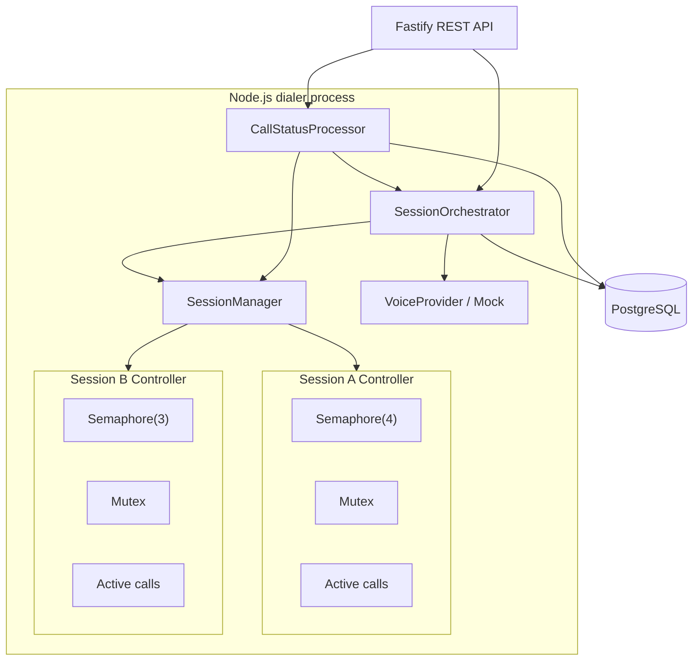
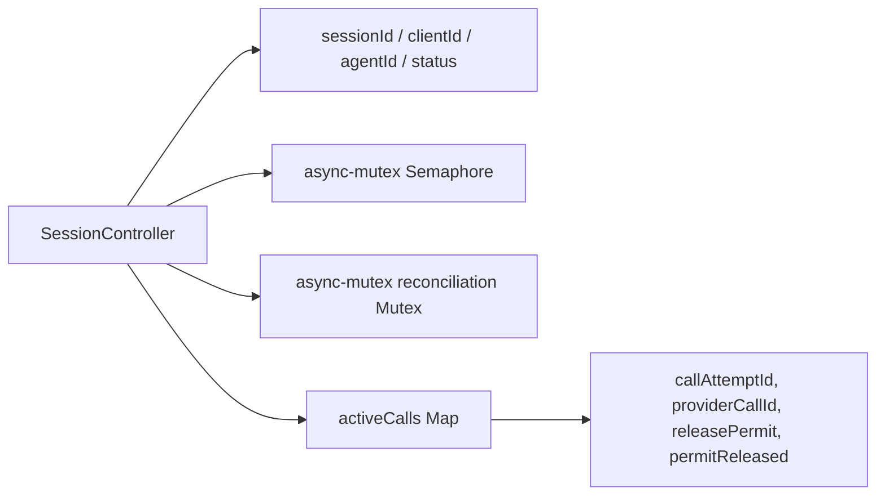
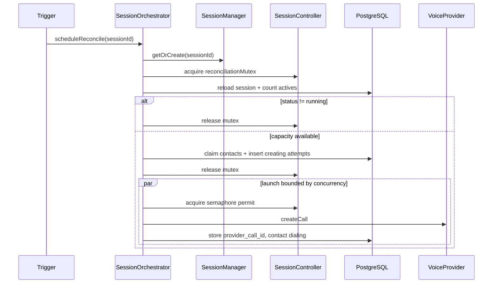
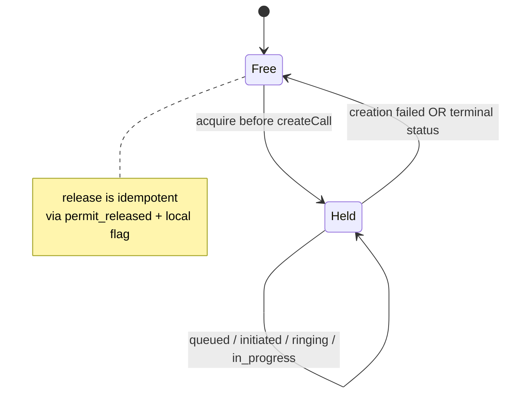
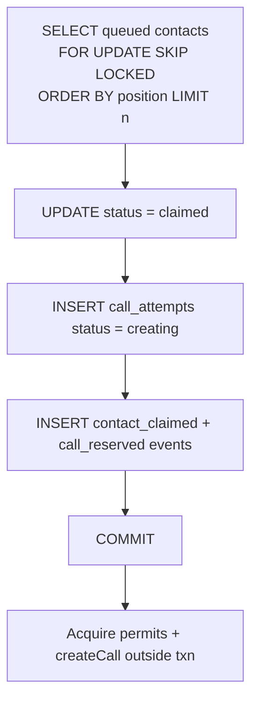
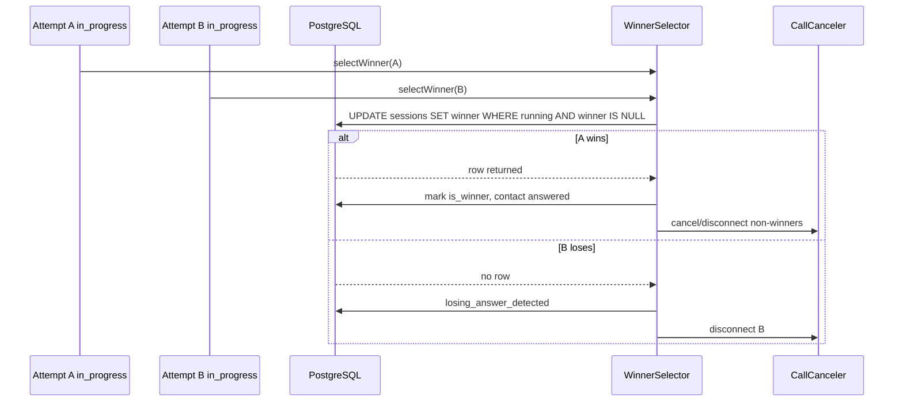
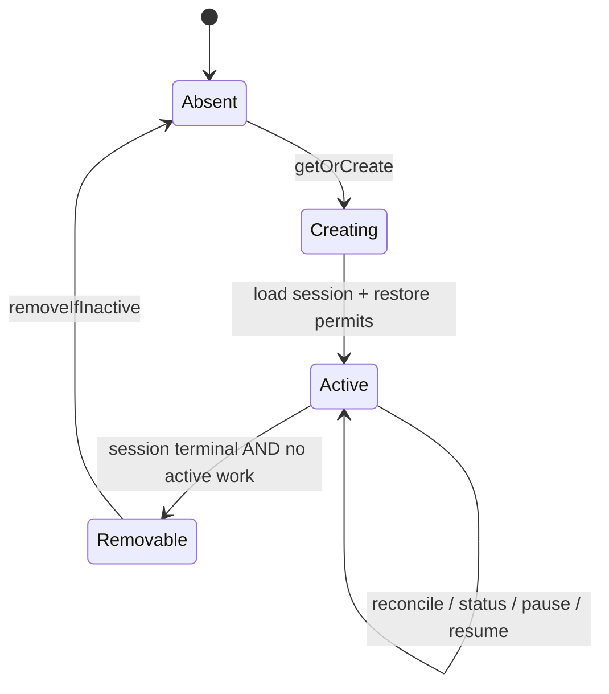

# Architecture

## 1. Multiple-session runtime

Sessions reconcile and dial concurrently. Session A's saturated semaphore never blocks Session B.

## 2. Session controller internals

The durable contact queue lives in PostgreSQL (`dialing_contacts`), not in the controller.

## 3. Reconciliation flow

Provider calls always happen outside the DB transaction and outside the mutex.

## 4. Semaphore permit lifecycle

## 5. Contact claiming transaction

## 6. Winner-selection race

The semaphore does not choose the winner — PostgreSQL does.

## 7. Controller creation and removal lifecycle

Controllers survive browser disconnects and polling gaps. Removal is gated on terminal persisted status plus idle local runtime state.
