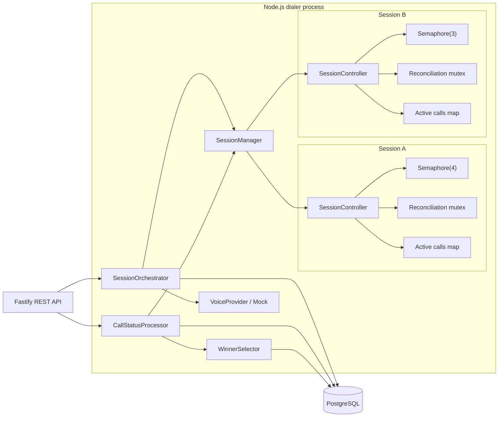
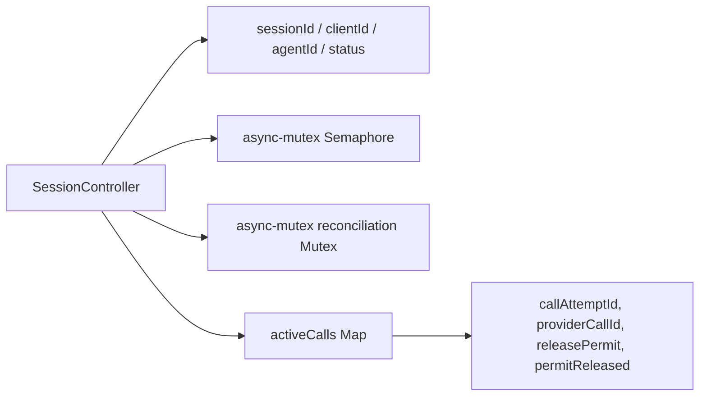
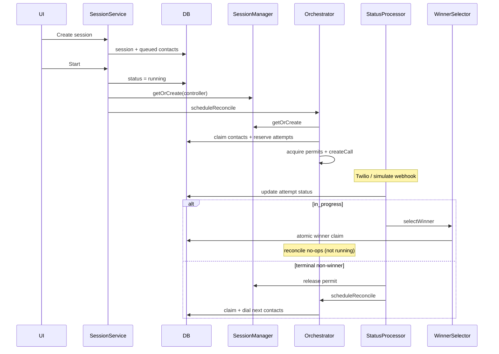
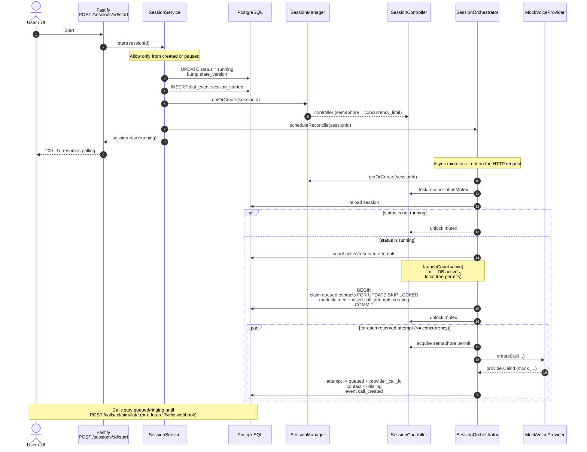
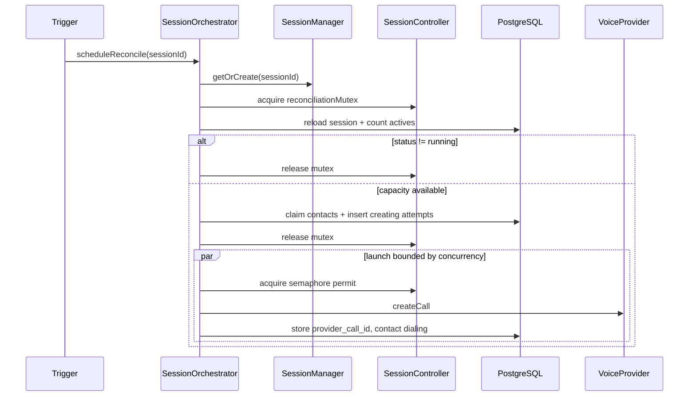
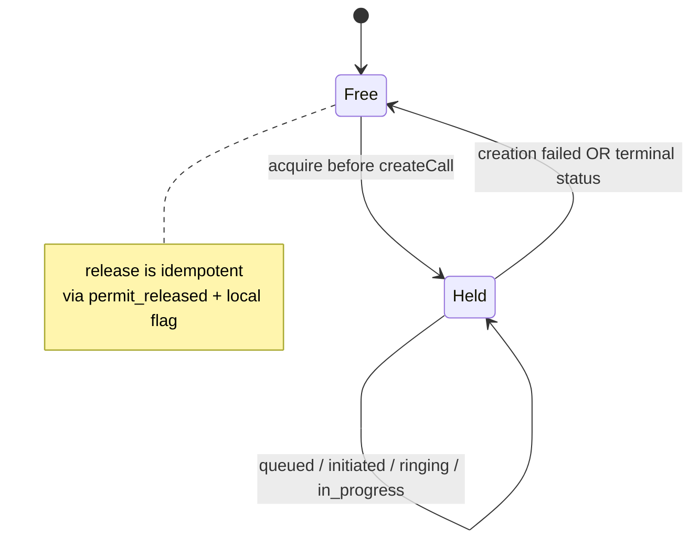
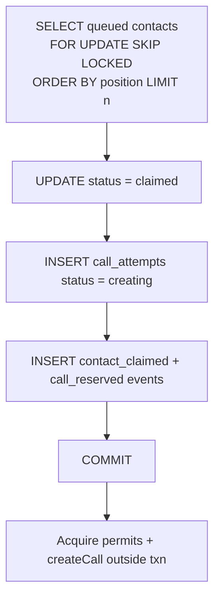
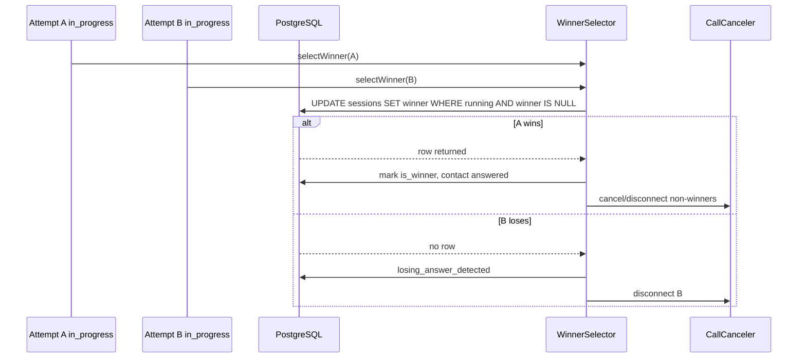
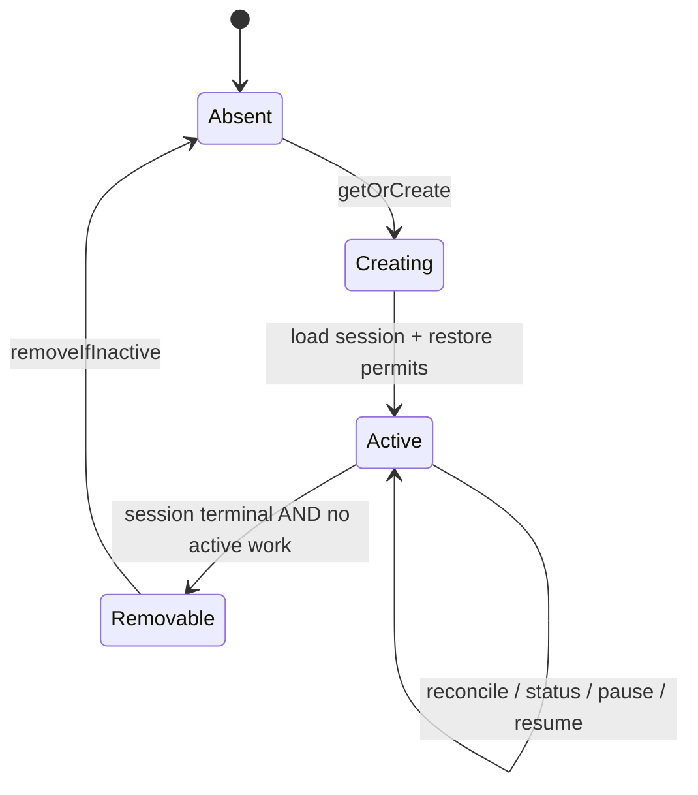

# Architecture

## 1. Multiple-session runtime

One Node process runs many sessions in parallel. PostgreSQL holds durable state; each session gets its own in-memory controller with an isolated semaphore and reconciliation mutex.

Session A's saturated semaphore never blocks Session B.

## 2. Session controller internals

Per-session runtime state only: admission control (semaphore), serialized reconciliation (mutex), and a map of active calls with permit handles. The contact queue lives in PostgreSQL, not here.

## 3. End-to-end lifecycle

The happy path from create to completion: persist a session, start dialing, fill concurrency, react to call status, then either pick a winner or dial the next contact. Reconciliation runs only while status is `running`.

## 4. What happens when you press Start

Start is a fast HTTP transition: mark the session `running`, ensure a controller exists, schedule reconciliation, and return. Actual dialing happens asynchronously in a microtask after the response.

### Start vs dial (split of responsibilities)

| Phase | When | What |
| --- | --- | --- |
| **Synchronous (HTTP)** | During Start click | Validate transition -> persist `running` -> ensure controller -> schedule reconcile -> return |
| **Asynchronous** | Right after response | Mutex -> capacity math -> claim contacts in Postgres -> acquire permits -> `VoiceProvider.createCall` |
| **Later** | Simulate / webhook | Status processor advances ringing / answer / terminal; winner selection; more reconcile |

The Start button does **not** wait for the provider. The mock provider only creates fake IDs; ring/answer still come from `/simulate`.

## 5. Reconciliation flow

Reconciliation fills unused concurrency: lock the session mutex, claim contacts in Postgres, release the mutex, then acquire permits and call the voice provider. Triggered on start, resume, and terminal non-winner statuses.

Provider calls always happen outside the DB transaction and outside the mutex.

## 6. Semaphore permit lifecycle

Each in-flight call holds one semaphore permit from `createCall` until creation fails or the attempt reaches a terminal status. Release is idempotent via `permit_released` in the DB and a local flag on the controller.

## 7. Contact claiming transaction

Contacts are claimed atomically in Postgres before any provider call. `FOR UPDATE SKIP LOCKED` lets concurrent reconcilers safely pull the next batch without double-dialing.

## 8. Winner-selection race

When a call goes `in_progress`, the first attempt to atomically set `sessions.winning_call_attempt_id` wins. Losers are disconnected; non-winners are cancelled. The semaphore does not choose the winner — PostgreSQL does.

## 9. Controller creation and removal lifecycle

Controllers are created lazily on first use and restored from Postgres on process restart. They are removed only after the session reaches a terminal status and all local work (active calls, permits, reconciliation) is idle.

