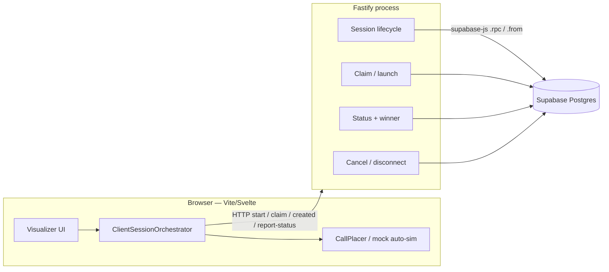
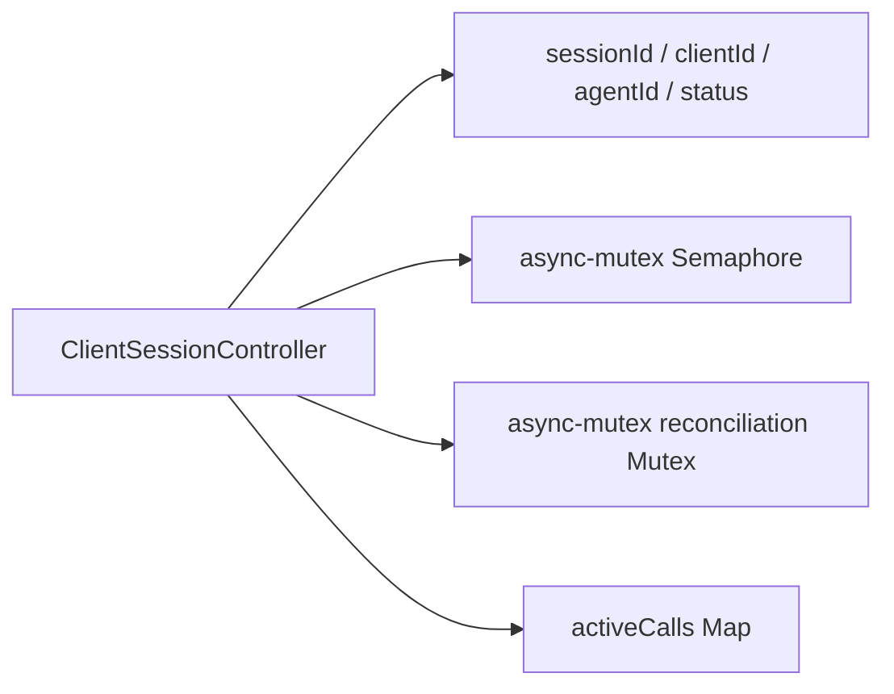
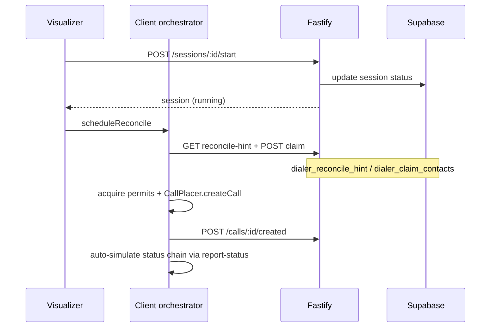
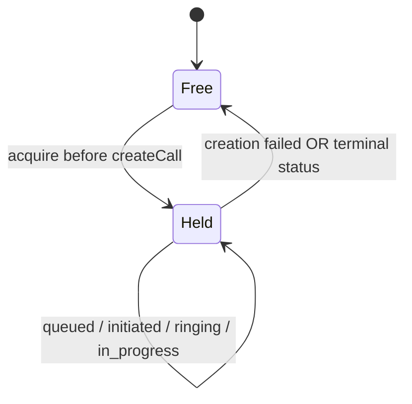
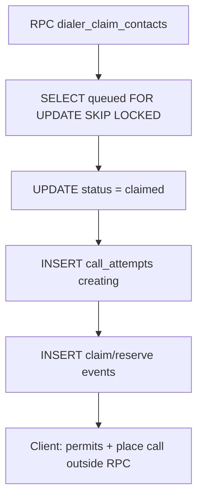
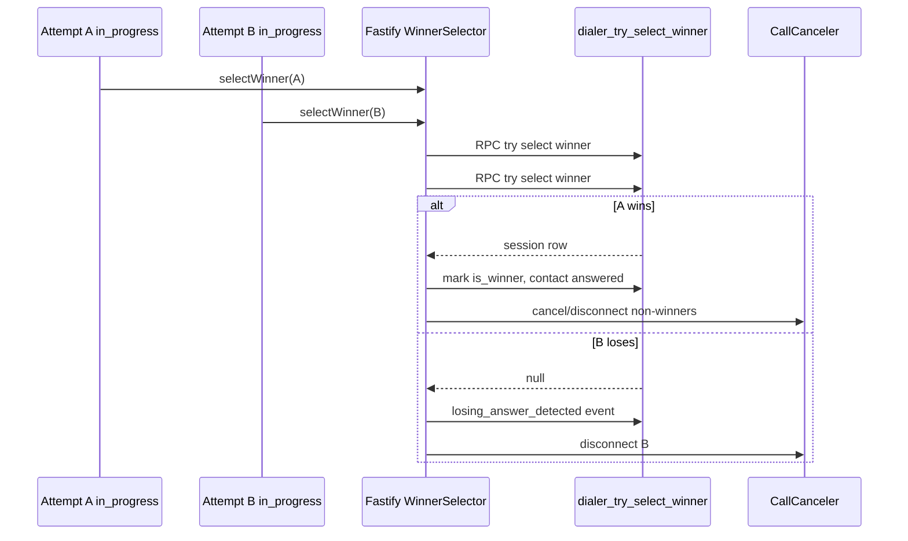
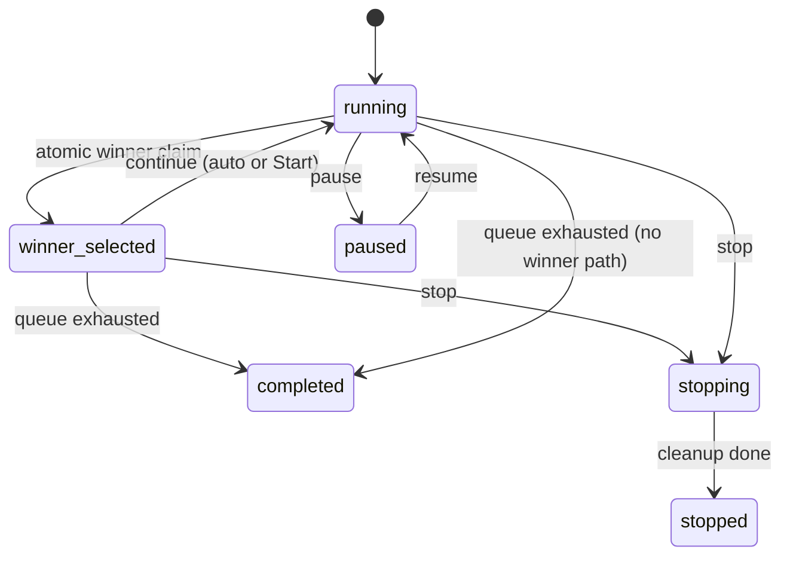

# Architecture

Standalone concurrent outbound dialer: **Fastify** HTTP API + **Supabase Postgres** (service-role **RPC** / PostgREST) as the system of record. Reconciliation and dial launch are owned by the **browser client**. Atomic claim, winner selection, and validated status transitions run in Postgres via `dialer_*` RPCs.

Related plans: [client-side orchestrator](./implementation-plans/client-side-orchestrator.md), [multi-round continue](./implementation-plans/multi-round-session-continue.md), [Nebula migration](./implementation-plans/nebula-migration.md).

> **Current stack:** Fastify + Vite/Svelte visualizer + Supabase RPC. Nebula integration (SvelteKit `/api/dialer/*`, feature flag) is planned separately — see the Nebula migration plan. This repo does **not** use SvelteKit for the API today.

---

## 1. Repository layout

```text
concurrent-outbound-dialer/
├── src/                            # Fastify API (Node 22)
│   ├── server.ts / app.ts          # Boot + service wiring
│   ├── routes/                     # Fastify plugins (sessions, calls, nebula, mock, health)
│   ├── services/                   # Lifecycle, claim/launch, status, winner, cancel, recovery
│   ├── repositories/               # Supabase .rpc / .from access
│   ├── database/
│   │   ├── supabase.ts             # createDialerSupabase (service role)
│   │   ├── migrate.ts              # Optional DATABASE_URL migrator
│   │   └── pool.ts                 # pg pool — migrate tooling only
│   ├── controllers/                # In-memory SessionManager / SessionController
│   ├── domain/                     # Types, statuses, transition rules, errors
│   ├── providers/                  # VoiceProvider + mock (cancel / disconnect)
│   └── config/env.ts               # SUPABASE_URL + service role (runtime)
├── frontend/                       # Vite + Svelte 5 visualizer
│   └── src/lib/
│       ├── orchestrator/           # Client control plane
│       ├── browser-call-dialer/    # In-call UI helpers + types
│       ├── components/             # Boards, BrowserCallDialer, WinnerPopup, …
│       ├── api.ts / session-client # HTTP to Fastify (proxied in dev)
│       └── store.svelte.ts
├── migrations/
│   ├── 001_dialer_schema.sql       # Tables / constraints
│   └── 002_dialer_supabase_rpcs.sql# dialer_* RPCs (claim, winner, create, …)
├── tests/                          # unit/ + integration/ (vitest)
└── docs/
```

### Server module map (`src/`)

| Area | Responsibility |
| --- | --- |
| `routes/` | HTTP adapters → session / claim / status / nebula / mock |
| `services/session-service` | Create/start/pause/resume/stop/continue, snapshots |
| `services/call-launch` | Claim contacts, mark created / creation-failed, reconcile-hint |
| `services/call-status-processor` | Status transitions; winner / complete-or-continue; `triggeredReconcile` |
| `services/winner-selector` | Atomic winner via `dialer_try_select_winner`; cancel losers |
| `services/call-canceler` | Cancel / disconnect non-winners / stop cleanup |
| `services/session-completion` | Queue exhaustion → `completed`, or auto-continue |
| `repositories/` | Supabase client wrappers (`.rpc` for atomic ops, `.from` for reads/updates) |
| `providers/` | Provider-neutral voice API for cancel/disconnect |

**Composition:** `SUPABASE_URL` + service role → `supabase-js` → repositories/services → Fastify routes.  
`DATABASE_URL` is **optional** and only used by `npm run db:migrate`.

### HTTP surface

Visualizer talks to Fastify (in dev, Vite proxies `/api` → `:3000`). Path shapes:

| Route group | Paths (summary) |
| --- | --- |
| Health | `GET /health` |
| Sessions | `POST /sessions`, `GET /sessions/:id`, `/status`, `/contacts`, `/calls`, `/events`, `/reconcile-hint` |
| Session control | `POST .../start`, `/pause`, `/resume`, `/stop`; `PATCH .../auto-continue` |
| Claim / launch | `POST /sessions/:id/claim` |
| Calls | `POST /calls/:id/report-status`, `/created`, `/creation-failed` |
| Nebula import | `GET /nebula/users`, prospect lists / contacts (optional `NEBULA_SUPABASE_*`) |

Optional `SERVICE_API_KEY`: when set, API routes except health require `Authorization: Bearer …`.

Lifecycle endpoints flip durable session status only. They do **not** launch dials — the client schedules reconcile after start / resume / continue.

### Visualizer + client orchestrator

| Piece | Role |
| --- | --- |
| `frontend/.../orchestrator/` | Reconcile loop, semaphore, mutex, mock `CallPlacer`, client auto-simulate |
| `store.svelte.ts` | Session lifecycle → API then `scheduleReconcile`; polling is UI refresh |
| Boards / dialer UI | Concurrency, contacts, `BrowserCallDialer`, WinnerPopup |
| `session-client.ts` / `api.ts` | `fetch` to Fastify API |

### Durable schema (`migrations/`)

| Table | Purpose |
| --- | --- |
| `dialing_sessions` | Lifecycle, `concurrency_limit` (1–15), `auto_continue`, current `winning_call_attempt_id` |
| `dialing_contacts` | Ordered durable batch per session |
| `call_attempts` | Reserved/active attempts; `is_winner`, `permit_released` |
| `dial_events` | Append-only lifecycle / diagnostic history |

Constraints:

- Partial unique index: **one active session per `client_id`** (non-terminal statuses)
- Multi-round continue clears `winning_call_attempt_id` while prior attempts keep `is_winner = true`

### Key RPCs (`002_dialer_supabase_rpcs.sql`)

| RPC | Purpose |
| --- | --- |
| `dialer_create_session` | Session + contacts + `session_created` event (atomic) |
| `dialer_claim_contacts` | `FOR UPDATE SKIP LOCKED` claim + `creating` attempts |
| `dialer_try_select_winner` | Conditional `winning_call_attempt_id` / `winner_selected` |
| `dialer_continue_from_winner` | Clear winner pointer → `running` |
| `dialer_reconcile_hint` | Active / queued / claimed counts + limit |
| `dialer_mark_call_created` / `_creation_failed` | Post-place attempt + contact updates |

Simple reads/updates use PostgREST (`.from`). Critical sections use RPC so concurrency stays correct without a runtime `pg` pool.

---

## 2. Runtime topology



- **Browser:** decides *when* to claim and dial; holds the admission semaphore; places calls; reports status.
- **Fastify:** trusted HTTP API — auth, Zod validation, orchestration of services. Does not place Twilio calls in production mock path beyond cancel/disconnect via `VoiceProvider`.
- **Supabase:** source of truth. Atomic claim/winner/create run inside Postgres functions; the API uses the **service role** after request auth succeeds. Service role is never shipped to the visualizer.
- Closing the tab stalls dialing until a client hydrates a `running` session and schedules reconcile.

---

## 3. Client session controller

Per-session browser runtime: a semaphore, a reconciliation mutex, and an active-call map. The contact queue lives in Postgres.



### Semaphore — how many calls may run

Admission control for in-flight dials.

- Capacity = `concurrency_limit` (1–15)
- Acquire before `createCall`; release on creation failure or terminal status
- Stops the client from dialing more contacts than the limit allows
- Do **not** enqueue the entire remaining contact batch as waiters — Postgres keeps `queued` contacts until capacity opens

`calculateLaunchCount` combines **persisted** active count from the API with local free permits so a refresh cannot over-dial.

### Mutex — who may claim next

Serializes the short “decide what to claim” step for one session.

- Only one reconcile claim path runs at a time
- Held while loading session state, computing `launchCount`, and calling `POST /claim`
- Released **before** semaphore acquires and call placement
- Prevents overlapping reconciles from double-claiming the same capacity

In short: **mutex** = who may claim next; **semaphore** = how many calls may run; **Postgres RPC** = which contacts were claimed and which answer won.

---

## 4. Responsibility split

| Mechanism | Job |
| --- | --- |
| Client mutex | Who may run reconcile/claim next |
| Client semaphore | How many legs may be in flight |
| `dialer_claim_contacts` | Which contacts were reserved (`SKIP LOCKED`) |
| `dialer_try_select_winner` | Which answer won |
| `CallCanceler` / `VoiceProvider` | Drop losers after winner is recorded |

Client owns *when*. Postgres owns *who*.

---

## 5. What happens when you press Start

Start is a fast HTTP transition: mark the session `running` (or continue from `winner_selected`) and return. The client then schedules reconciliation.



---

## 6. Reconciliation

Reconciliation tops up dials to the concurrency limit when capacity opens.

1. Bail if session is not `running`
2. Compute `launchCount` from reconcile-hint + free permits
3. `POST /claim` → `dialer_claim_contacts`
4. Outside the mutex: acquire permit, place call, `POST /created`

Triggered by Start / Resume / auto-continue, terminal non-winner statuses (`triggeredReconcile`), or creation failure.

---

## 7. Permit lifecycle



---

## 8. Contact claiming

Contacts are claimed in Postgres **before** any dial via `dialer_claim_contacts` (`FOR UPDATE SKIP LOCKED`). Concurrent claim requests cannot double-assign the same contact.



---

## 9. Winner-selection race

When a call goes `in_progress`, `WinnerSelector` calls `dialer_try_select_winner`. The first update that sees `status = 'running'` and `winning_call_attempt_id IS NULL` wins. Losers are disconnected/cancelled. The semaphore does not choose the winner — PostgreSQL does.



Across rounds, many attempts may have `is_winner = true`. Only one attempt is the **current** `winning_call_attempt_id` at a time; continue clears it before the next `running` round.

---

## 10. Multi-round continue

After a connect, the session sits in `winner_selected` (client reconcile no-ops). When the winning call ends:

1. If no queued/claimed contacts remain and no actives → `completed`
2. Else if `auto_continue` → `dialer_continue_from_winner` → `running`, response sets `triggeredReconcile` → client refills
3. Else wait for agent `POST .../start` then client `scheduleReconcile`



---

## 11. Recovery and process lifecycle

On Fastify ready:

- Fail stale `creating` attempts
- Run complete-or-continue when a winner is already terminal

It does not refill the dial queue. An open visualizer hydrates local controller state and `scheduleReconcile`s when session status is `running`.

Graceful shutdown: stop accepting work, close HTTP. Durable state remains in Supabase (no runtime `pg` pool to close).

Integration tests use `TestClientOrchestrator` against Supabase (service role + RPCs applied). Unit tests do not require `DATABASE_URL`.

---

## 12. Call placement and mock status progression

Business logic stays provider-neutral (`provider_call_id`, not Twilio SIDs).

**Client `CallPlacer`** — injectable interface used by the orchestrator after a successful claim:

```ts
interface CallPlacer {
  createCall(claim): Promise<{ providerCallId }>
  cancelNonWinners?(sessionId, winningCallAttemptId): Promise<void>
}
```

The visualizer uses a mock placer that invents provider IDs. After `/created`, `ClientMockAutoSimulator` advances attempts through `report-status` (initiated → ringing → answer or terminal).

**Server `VoiceProvider`** — cancel/disconnect when winner cleanup or pause/stop needs to tear down provider legs:

```ts
interface VoiceProvider {
  createCall(input): Promise<{ providerCallId; status: "queued" }>
  cancelCall(providerCallId): Promise<void>
  disconnectCall(providerCallId): Promise<void>
}
```

---

## 13. Env (runtime vs migrate)

| Variable | Runtime API | `db:migrate` |
| --- | --- | --- |
| `SUPABASE_URL` + `SUPABASE_SERVICE_ROLE_KEY` | Required (or `NEBULA_SUPABASE_*` fallback) | — |
| `DATABASE_URL` | Not used | Required to apply SQL files via `pg` |
| `SERVICE_API_KEY` | Optional HTTP gate | — |

Never expose the service role key to the Svelte visualizer.
