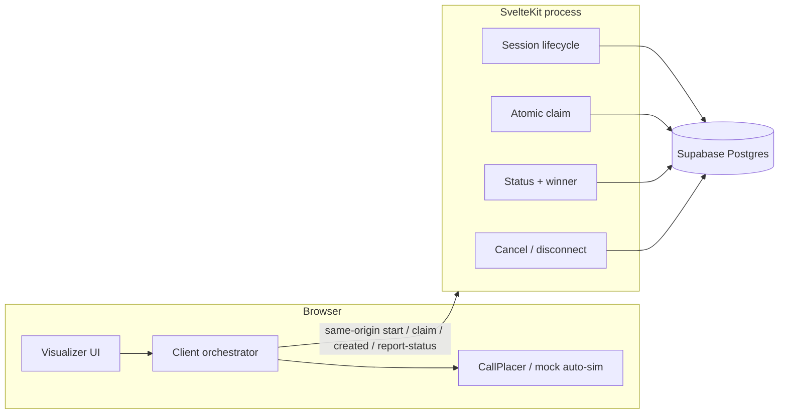
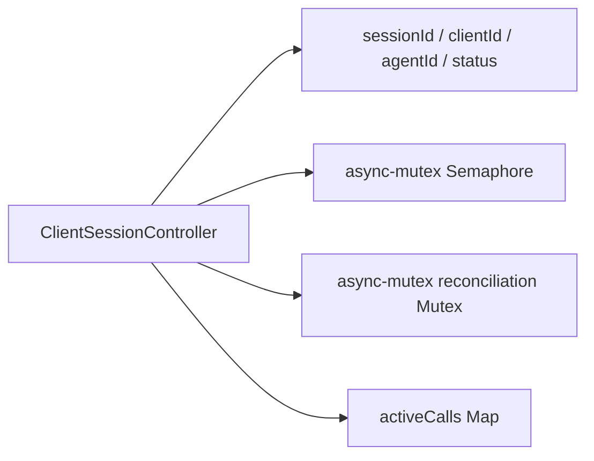
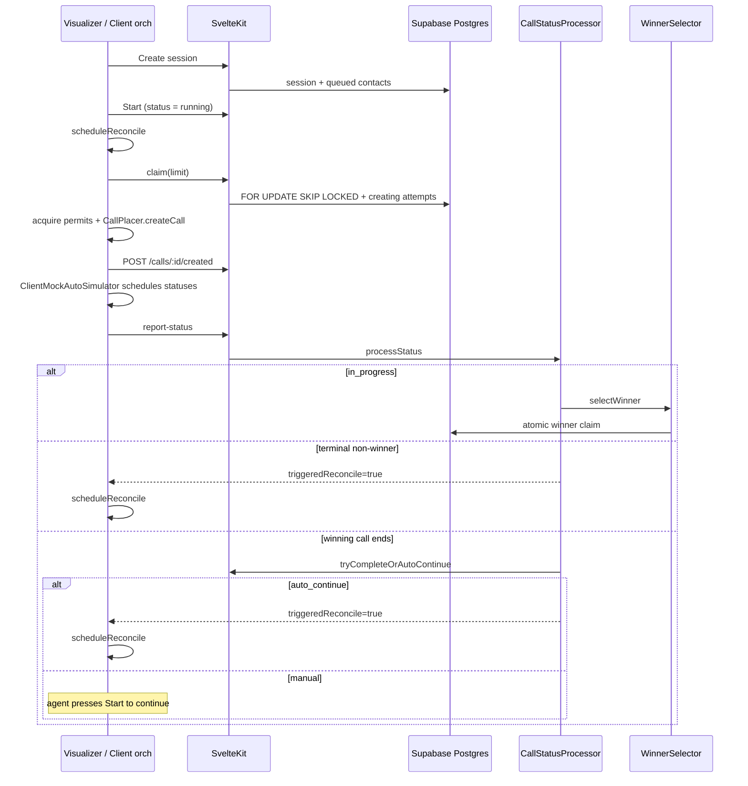
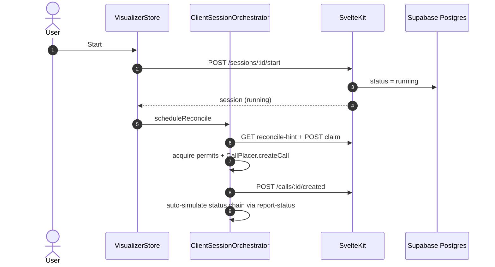
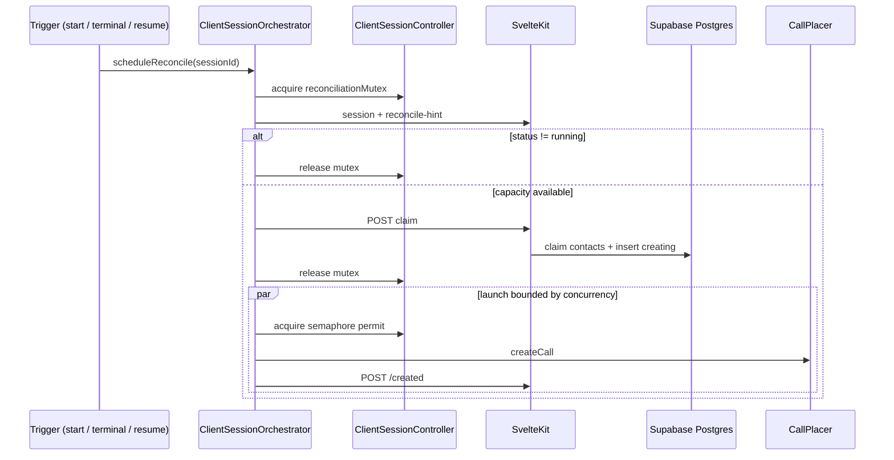
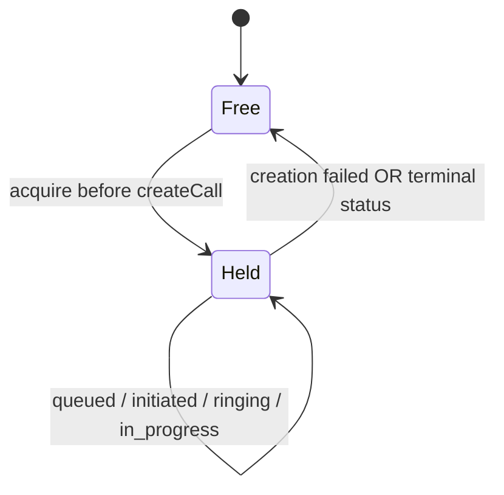
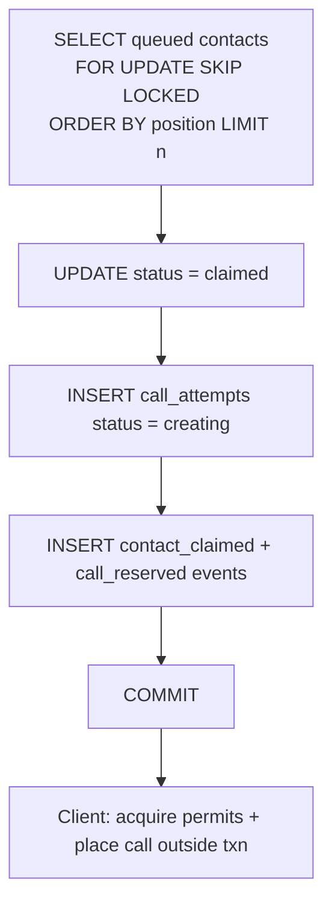
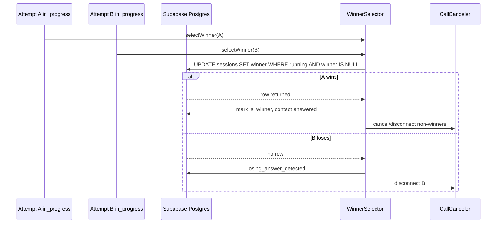
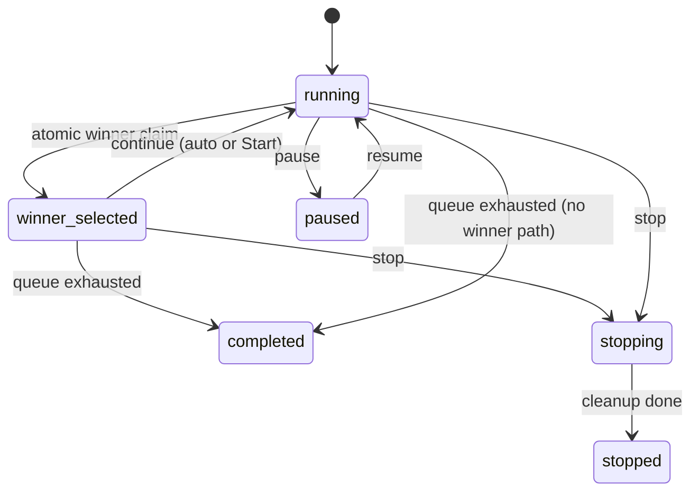

# Architecture

Standalone concurrent outbound dialer: **SvelteKit** + **Supabase Postgres** as the **system of record**, with reconciliation and dial launch owned by the **browser client**. Atomic claim, winner selection, and status validation stay on the Kit server (trusted layer — not browser RPCs).

Related plans: [client-side orchestrator](./implementation-plans/client-side-orchestrator.md), [multi-round continue](./implementation-plans/multi-round-session-continue.md), [Nebula migration](./implementation-plans/nebula-migration.md).

> **Migration note:** The live path is SvelteKit → Supabase. The former Fastify + Docker Compose Postgres stack is retired.

---

## 1. Repository layout

```text
concurrent-outbound-dialer/
├── src/
│   ├── routes/                 # SvelteKit pages + API (+server.ts)
│   │   ├── +page.svelte        # Visualizer UI
│   │   └── api/                # Session / claim / status HTTP surface
│   ├── lib/
│   │   ├── orchestrator/       # Client control plane (browser)
│   │   │   ├── client-session-orchestrator.ts
│   │   │   ├── client-session-controller.ts
│   │   │   ├── client-session-manager.ts
│   │   │   ├── client-mock-auto-simulator.ts
│   │   │   ├── call-placer.ts
│   │   │   └── session-client.ts
│   │   ├── server/dialer/      # Trusted server modules (Kit-only)
│   │   │   ├── services/       # Lifecycle, claim/launch, status, winner, cancel
│   │   │   ├── repositories/   # Postgres access (pg pool for claim/winner txns)
│   │   │   ├── domain/         # Types, statuses, transition rules, errors
│   │   │   └── providers/      # VoiceProvider + mock (cancel / disconnect)
│   │   └── store.svelte.ts     # Visualizer session store
│   ├── hooks.server.ts         # Optional API key / request wiring
│   └── app.html
├── supabase/
│   ├── config.toml
│   └── migrations/             # dialing_sessions / contacts / attempts / events
├── tests/                      # unit/ + integration/ (vitest; TestClientOrchestrator)
└── docs/                       # This file + implementation plans
```

### Server module map (`src/lib/server/dialer/`)

| Area | Responsibility |
| --- | --- |
| Kit `routes/api/` | HTTP adapters → session / claim / status handlers |
| `services/session-service` | Create/start/pause/resume/stop/continue, snapshots, serialization |
| `services/call-launch` | Claim contacts, mark created / creation-failed |
| `services/call-status-processor` | Apply status transitions; winner / complete-or-continue; returns `triggeredReconcile` |
| `services/winner-selector` | Atomic Postgres winner claim; cancel/disconnect losers |
| `services/call-canceler` | Cancel or disconnect non-winners / stop cleanup |
| `services/session-completion` | Queue exhaustion → `completed`, or auto-continue when enabled |
| `repositories/` | SQL for durable queue, attempts, events, claim txn |
| `providers/` | Provider-neutral voice API for cancel/disconnect |

Composition: Supabase DB URL → `pg` pool (claim/winner transactions) + service-role `supabase-js` where simple reads suffice → dialer services → Kit `+server.ts` routes.

### HTTP surface

Same path shapes the client orchestrator already calls (same-origin; no separate API origin):

| Route group | Paths (summary) |
| --- | --- |
| Health | `GET /health` (or Kit health equivalent) |
| Sessions | `POST /sessions`, `GET /sessions/:id`, `/status`, `/contacts`, `/calls`, `/events`, `/reconcile-hint` |
| Session control | `POST .../start`, `/pause`, `/resume`, `/stop`; `PATCH .../auto-continue` |
| Claim / launch | `POST /sessions/:id/claim` |
| Calls | `POST /calls/:id/report-status`, `/created`, `/creation-failed` |

Optional `SERVICE_API_KEY`: when set, API routes except health require `Authorization: Bearer …`.

Lifecycle endpoints flip durable session status only. They do **not** launch dials — the client schedules reconcile after start / resume / continue.

### Visualizer + client orchestrator

| Piece | Role |
| --- | --- |
| `lib/orchestrator/` | Reconcile loop, semaphore, mutex, mock `CallPlacer`, client auto-simulate |
| `lib/store.svelte.ts` | Session lifecycle → API then `scheduleReconcile`; polling is UI refresh |
| Boards / dialer UI | Concurrency, semaphore debug, contacts, WinnerPopup |
| `session-client.ts` | `fetch` to same-origin Kit routes |

### Durable schema (`supabase/migrations/`)

| Table | Purpose |
| --- | --- |
| `dialing_sessions` | Lifecycle, `concurrency_limit` (1–15), `auto_continue`, current `winning_call_attempt_id` |
| `dialing_contacts` | Ordered durable batch per session |
| `call_attempts` | Reserved/active attempts; `is_winner`, `permit_released` |
| `dial_events` | Append-only lifecycle / diagnostic history |

Constraints:

- Partial unique index: **one active session per `client_id`** (non-terminal statuses)
- Multi-round continue clears `winning_call_attempt_id` while prior attempts keep `is_winner = true`

Dev default: **local Supabase CLI** (`supabase start`). Hosted Supabase via env (`SUPABASE_URL`, service role, database URL) when configured.

---

## 2. Runtime topology



- **Browser:** decides *when* to claim and dial; holds the admission semaphore; places calls; reports status.
- **SvelteKit:** trusted HTTP API and durable authority — session lifecycle writes, `FOR UPDATE SKIP LOCKED` claim, validated status transitions, atomic winner selection, and cancel/disconnect of non-winners. Claim/winner use a **`pg` pool** against the Supabase database URL (supabase-js alone cannot express those multi-statement transactions cleanly).
- **Supabase Postgres:** source of truth for sessions, contacts, attempts, and events.
- Closing the tab stalls dialing until a client hydrates a `running` session and schedules reconcile.

---

## 3. Client session controller

Per-session browser runtime: a semaphore, a reconciliation mutex, and an active-call map. The contact queue lives in PostgreSQL.



### Semaphore — how many calls may run

Admission control for in-flight dials.

- Capacity = `concurrency_limit` (1–15)
- Acquire a permit **before** placing a call; hold it while the attempt is active (`creating` → `in_progress`)
- Release on terminal status or creation failure
- Stops the client from dialing more contacts than the limit allows
- Do **not** enqueue the entire remaining contact batch as waiters — Postgres keeps `queued` contacts until capacity opens

`calculateLaunchCount` combines **persisted** active count from the API with local free permits so a refresh cannot over-dial.

### Mutex — who may claim next

Serializes the short “decide what to claim” step for one session.

- Only one reconcile claim path runs at a time
- Held while loading session state, computing `launchCount`, and calling `POST /claim`
- Released **before** semaphore acquires and call placement
- Prevents overlapping reconciles from double-claiming the same capacity

In short: **mutex** = who may claim next; **semaphore** = how many calls may run.

Server-side permit bookkeeping (if present) is only for cancel/recovery — not the client admission semaphore.

---

## 4. End-to-end lifecycle



### Session statuses

`created` → `running` ⇄ `paused` → `winner_selected` → (continue) `running` … → `stopping` → `stopped` | `completed` | `failed`

`Start` from `winner_selected` is the **manual continue** path (rejected while any call is still active).

---

## 5. What happens when you press Start

Start is a fast HTTP transition: mark the session `running` (or continue from `winner_selected`) and return. The client then schedules reconciliation.



| Phase | Who | What |
| --- | --- | --- |
| **HTTP Start** | Kit server | Validate transition → persist `running` → return |
| **Reconcile** | Client | Mutex → capacity math → claim → permits → place call → `/created` |
| **Status** | Client → Kit | `report-status`; server validates + winner/complete; client refills if `triggeredReconcile` |

---

## 6. Reconciliation flow



Call placement happens outside the DB claim transaction and outside the mutex.

---

## 7. Semaphore permit lifecycle

See [§3](#3-client-session-controller) for the role of the semaphore vs the mutex. This section covers the permit state machine only.

Each in-flight call holds one client semaphore permit until creation fails or the attempt reaches a terminal status. Durable `permit_released` on the attempt row is the server-side idempotency flag for cancel/recovery.



---

## 8. Contact claiming transaction

Contacts are claimed atomically in Postgres before any dial. `FOR UPDATE SKIP LOCKED` lets concurrent clients safely pull the next batch without double-dialing.



---

## 9. Winner-selection race

When a call goes `in_progress`, the first attempt to atomically set `sessions.winning_call_attempt_id` while `status = 'running'` wins. Losers are disconnected; other non-winners are cancelled. The semaphore does not choose the winner — PostgreSQL does.



Across rounds, many attempts may have `is_winner = true`. Only one attempt is the **current** `winning_call_attempt_id` at a time; continue clears it before the next `running` round.

---

## 10. Multi-round continue

After a connect, the session sits in `winner_selected` (client reconcile no-ops). When the winning call ends:

1. If no queued/claimed contacts remain and no actives → `completed`
2. Else if `auto_continue` → clear winner pointer, `running`, response sets `triggeredReconcile` → client refills
3. Else wait for agent `POST .../start` then client `scheduleReconcile`



---

## 11. Recovery and process lifecycle

On Kit process start (or first trusted request sweep):

- Fail stale `creating` attempts
- Run complete-or-continue when a winner is already terminal

It does not refill the dial queue. An open visualizer hydrates local controller state and `scheduleReconcile`s when session status is `running`.

Graceful shutdown: stop the Kit server, end the DB pool.

Integration tests use `TestClientOrchestrator` (`tests/helpers/test-orchestrator.ts`) as a headless stand-in for the browser loop.

---

## 12. Call placement and mock status progression

Business logic stays provider-neutral (`provider_call_id`, not Twilio SIDs).

**Client `CallPlacer`** — injectable interface used by the orchestrator after a successful claim:

```ts
interface CallPlacer {
  createCall(claim): Promise<{ providerCallId }>
  cancelNonWinners?(sessionId, winningCallAttemptId): Promise<void>
}
```

The visualizer uses a mock placer that invents provider IDs. After `/created`, `ClientMockAutoSimulator` advances attempts through `report-status` (initiated → ringing → answer or terminal), with the same timing/outcome knobs as the Developer Mode auto-simulate panel.

**Server `VoiceProvider`** — used for cancel/disconnect when the winner selector or pause/stop cleanup needs to tear down provider legs:

```ts
interface VoiceProvider {
  createCall(input): Promise<{ providerCallId; status: "queued" }>
  cancelCall(providerCallId): Promise<void>
  disconnectCall(providerCallId): Promise<void>
}
```
