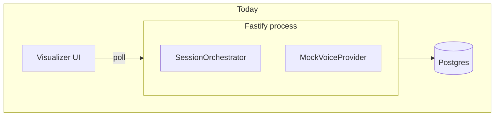
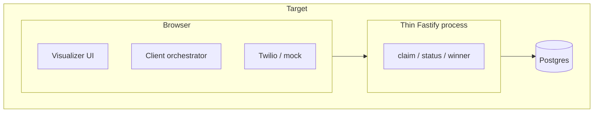

# Migration Plan: Client-Side Orchestrator

**Status:** Implemented  
**Created:** 2026-07-27  
**Updated:** 2026-07-31  
**Scope:** Move reconciliation, semaphore admission, and call-launch orchestration from the Node dialer process into the browser client. Business rules stay the same; only **where** the loop runs changes.

---

## Summary

Today the dialer is a long-lived Node process that owns:

- `SessionOrchestrator` — reconcile loop (claim → acquire permit → `VoiceProvider.createCall`)
- `SessionController` / `SessionManager` — in-memory semaphore, reconciliation mutex, active-call map
- Triggers from `SessionService` (start/resume/continue), `CallStatusProcessor` (terminal non-winner), and `RecoveryService` (boot)

After migration:

- **Client** runs the orchestrator loop (one tab ≈ one agent session worker).
- **Backend** remains the durable system of record: Postgres, atomic claim, atomic winner selection, validated status transitions, session lifecycle APIs.

This aligns naturally with Nebula integration (Approach A+D): the browser already places Twilio legs; the client orchestrator decides **when** to claim the next contact and **when** to dial.





---

## What moves vs what stays

### Moves to the client

| Today (server) | Client equivalent |
| --- | --- |
| `SessionOrchestrator` | `ClientSessionOrchestrator` in `frontend/src/lib/orchestrator/` |
| `SessionController` | `ClientSessionController` (semaphore + mutex + activeCalls) |
| `SessionManager.getOrCreate` | Per-tab controller map keyed by `sessionId` |
| `scheduleReconcile` / drain loop | Same microtask queue pattern in browser |
| `calculateLaunchCount` + capacity math | Port unchanged from `src/domain/statuses.ts` |
| `voiceProvider.createCall` | **Injectable** `CallPlacer` — mock: `POST /simulate` chain; Nebula: `initiateBrowserCall` |
| Reconcile triggers on terminal non-winner | Client status handler calls `scheduleReconcile` after reporting terminal status |
| Reconcile on start/resume/continue | Client calls session transition API, then `scheduleReconcile` locally |
| Recovery reconcile scheduling | Client hydrates controller from `GET /sessions/:id/runtime` + active call count on mount |
| Mock auto-simulator driving statuses | Optional client timer calling status API (dev only) |

### Stays on the backend (non-negotiable for correctness)

| Component | Why it stays server-side |
| --- | --- |
| Postgres + migrations | Durable queue, attempts, events |
| `claimContactsAndReserveAttempts` | Must run in a DB transaction with `FOR UPDATE SKIP LOCKED` |
| `trySelectWinner` atomic `UPDATE` | Race-safe winner selection |
| `evaluateCallAttemptTransition` enforcement | Prevents illegal status regressions (can be shared lib, validated on server) |
| Session lifecycle writes | `created` → `running` → `winner_selected` → `completed`, etc. |
| `releasePermitDurable` / `permit_released` flag | Idempotent permit bookkeeping across refresh |
| `CallCanceler` (initially) | Server can signal cancel; Nebula path may move cancel to client Twilio APIs later |
| Auth / tenancy | BFF or API key; browser never gets raw DB |

### Removed from the backend (after cutover)

- `SessionOrchestrator` class and `scheduleReconcile` wiring
- `InMemorySessionManager` + server `SessionController` (or reduce to read-only runtime introspection for dev)
- `RecoveryService` reconcile scheduling (client owns recovery)
- Server `MockVoiceProvider` + `MockCallAutoSimulator` as orchestration drivers (optional keep for integration tests only)
- `GET /sessions/:id/runtime` semaphore truth — becomes **client-local** (API may return DB-derived counts only)

---

## Target client architecture

```text
frontend/src/lib/orchestrator/
├── client-session-controller.ts   # Semaphore, mutex, activeCalls (port of SessionController)
├── client-session-manager.ts      # Map<sessionId, controller>
├── client-session-orchestrator.ts # reconcileSession, scheduleReconcile, drain
├── call-placer.ts                 # interface + mock + (later) nebula adapter
├── status-handler.ts              # port of CallStatusProcessor trigger side (calls APIs)
├── session-client.ts              # wraps dialerApi + new claim/report endpoints
└── index.ts                       # createClientOrchestrator(store, callPlacer)

frontend/src/lib/domain/           # shared pure rules (copy or package from src/domain)
├── statuses.ts
└── errors.ts
```

**`VisualizerStore`** becomes the integration point:

- On `start()` / `resume()` / continue: call backend lifecycle endpoint → `orchestrator.scheduleReconcile(sessionId)`.
- Stop polling-driven reconcile; polling becomes **UI refresh only** (or event-driven refresh after each orchestrator step).
- `simulate()` in dev: client reports status → backend → client `statusHandler` → maybe `scheduleReconcile`.

---

## New / changed API surface

Backend shrinks to **commands + atomic operations**. Orchestration timing moves to the client.

### Keep (unchanged or lightly adjusted)

| Method | Path | Notes |
| --- | --- | --- |
| `POST` | `/sessions` | Create session + contact batch |
| `GET` | `/sessions/:id` | Session row |
| `GET` | `/sessions/:id/status` | Snapshot for UI |
| `GET` | `/sessions/:id/contacts` | Contact batch |
| `GET` | `/sessions/:id/calls` | Attempts |
| `POST` | `/sessions/:id/start\|pause\|resume\|stop` | Lifecycle (no reconcile side effect) |
| `PATCH` | `/sessions/:id/auto-continue` | Preference |

### Add (replace internal orchestrator steps)

| Method | Path | Body | Purpose |
| --- | --- | --- | --- |
| `POST` | `/sessions/:id/claim` | `{ limit: number }` | Runs claim txn; returns `{ claims: ReservedClaim[] }` |
| `POST` | `/calls/:id/report-status` | `{ status: CallAttemptStatus }` | Validated transition + winner + terminal side effects |
| `POST` | `/calls/:id/created` | `{ providerCallId: string }` | After client dial succeeds: `creating` → `queued`, contact → `dialing` |
| `POST` | `/calls/:id/creation-failed` | `{ errorCode, errorMessage }` | Release permit + mark failed + return claim capacity |

Optional convenience (can merge into report-status):

| `POST` | `/sessions/:id/reconcile-hint` | — | Returns `{ sessionStatus, persistedActiveCount, queuedCount }` so client doesn't open multiple round trips |

### Remove or deprecate

| Method | Path | Reason |
| --- | --- | --- |
| `POST` | `/calls/:id/simulate` | Replace with `report-status` (keep alias during migration) |
| `GET` | `/sessions/:id/runtime` | Semaphore/mutex/orchestrator queue no longer on server (dev-only stub optional) |

**Important:** `POST /sessions/:id/start` must **stop** calling `orchestrator.scheduleReconcile`. It only flips DB status; the client schedules reconcile.

---

## Client reconcile loop (same logic, new home)

Pseudocode — identical structure to `SessionOrchestrator.reconcileSession`:

```ts
async function reconcileSession(sessionId: string) {
  const controller = sessionManager.getOrCreate(sessionId);
  controller.reconciliationPending = true;
  try {
    const reserved = await controller.reconciliationMutex.runExclusive(async () => {
      const session = await api.getSession(sessionId);
      if (session.status !== "running") return [];

      const persistedActiveCount = await api.countActiveAttempts(sessionId);
      const launchCount = calculateLaunchCount({
        concurrencyLimit: session.concurrencyLimit,
        persistedActiveCount,
        locallyAvailablePermits: controller.availablePermits(),
      });
      if (launchCount <= 0) return [];

      const { claims } = await api.claim(sessionId, launchCount);
      return claims;
    });

    await Promise.allSettled(reserved.map((item) => launchReserved(controller, item)));
  } finally {
    controller.reconciliationPending = false;
  }
}

async function launchReserved(controller, item) {
  await controller.acquirePermitForAttempt(item.callAttempt.id);
  try {
    const { providerCallId } = await callPlacer.createCall(item);
    await api.markCallCreated(item.callAttempt.id, providerCallId);
  } catch (e) {
    await api.markCallCreationFailed(item.callAttempt.id, e);
    controller.releasePermit(item.callAttempt.id);
    scheduleReconcile(sessionId);
  }
}
```

Status path (after mock/Twilio reports ringing → answered → terminal):

```ts
async function onStatusReport(callAttemptId, status) {
  const result = await api.reportStatus(callAttemptId, status);
  if (result.triggeredReconcile) scheduleReconcile(result.sessionId);
  if (result.winnerSelected) await callPlacer.cancelNonWinners(result.sessionId, result.winningCallAttemptId);
}
```

---

## Shared code strategy

Avoid duplicating business rules in two languages of truth.

**Recommended:** extract a shared package (or `shared/` folder compiled into both targets):

| Module | Contents |
| --- | --- |
| `domain/statuses.ts` | `calculateLaunchCount`, `evaluateCallAttemptTransition`, `canStartSession`, terminal/active sets |
| `domain/session.ts`, `call-attempt.ts`, `contact.ts` | Types only |
| `domain/errors.ts` | Error codes |

Server repositories stay server-only. Client never imports `pg`.

**Alternative (faster, messier):** copy `domain/statuses.ts` into `frontend/src/lib/domain/` and add a CI check that both files match.

---

## Phased migration

### Phase 0 — API split (backend still orchestrates)

1. Add `POST /sessions/:id/claim`, `POST /calls/:id/report-status`, `POST /calls/:id/created`, `POST /calls/:id/creation-failed`.
2. Refactor server orchestrator to call these same internal functions (single code path).
3. Integration tests hit new endpoints directly.

**Exit:** endpoints tested; server orchestrator unchanged externally.

### Phase 1 — Client orchestrator behind feature flag

1. Port `SessionController` + `SessionOrchestrator` to `frontend/src/lib/orchestrator/`.
2. Add `useClientOrchestrator` flag in visualizer (localStorage or env).
3. When ON:
   - `VisualizerStore.start()` does not rely on server reconcile.
   - Client owns `scheduleReconcile`; polling is UI-only.
4. Mock path: `CallPlacer` calls `report-status` / `created` instead of server mock provider.

**Exit:** visualizer session completes end-to-end with flag ON; flag OFF still uses server orchestrator.

### Phase 2 — Remove server orchestrator

1. Delete `SessionOrchestrator`, server `SessionManager` reconcile wiring, boot `RecoveryService` reconcile.
2. Slim `app.ts` — no `voiceProvider` in production path (keep for tests if needed).
3. Update `ARCHITECTURE.md` diagrams.
4. Remove `/runtime` or return DB-only fields.

**Exit:** single orchestration path (client).

### Phase 3 — Nebula / Twilio `CallPlacer`

1. Implement `NebulaCallPlacer`: `createCall` → existing `initiateBrowserCall` flow.
2. `cancelNonWinners` → Nebula cancel APIs when `report-status` returns winner.
3. Wire Confirm Bulk Call + `useDialerConcurrency` to client orchestrator + thin backend.

**Exit:** production Nebula bulk call uses client orchestrator + server claim/winner APIs.

---

## Trigger matrix (must preserve behavior)

| Event | Today (server) | After (client) |
| --- | --- | --- |
| Start / resume / continue | `SessionService` → `scheduleReconcile` | Client lifecycle API → `scheduleReconcile` |
| Terminal non-winner status | `CallStatusProcessor` → `scheduleReconcile` | Client `onStatusReport` → `scheduleReconcile` if API says so |
| Call creation failed | `launchReserved` catch → `scheduleReconcile` | Same in client |
| Winner selected | `WinnerSelector` → stop reconcile (session not `running`) | Same (server atomic winner; client stops reconcile) |
| Winning call ends | `tryCompleteOrAutoContinue` | Server in `report-status`; client schedules reconcile if continued to `running` |
| Pause | Session → `paused`; reconcile no-ops | Same |
| Stop | Cancel cleanup server-side | Client stops scheduling; API stop + optional cancel |
| Tab close | Server keeps running | **Session stalls** unless another tab takes over (see risks) |

---

## Risks and mitigations

| Risk | Impact | Mitigation |
| --- | --- | --- |
| Tab close / refresh | Reconcile stops; queue stuck mid-batch | On mount: if session `running` and actives < limit, client auto-`scheduleReconcile`; document “keep tab open” for v1 |
| Multi-tab same session | Double reconcile, double claims | Claim txn is safe (`SKIP LOCKED`); client uses `sessionStorage` leader election or disable second tab |
| Client clock / sleep | Delayed launches | Acceptable; same as Nebula bulk queue today |
| Cheating client | Fake statuses | Server validates transitions; winner atomic in DB; auth on all write endpoints |
| Lost semaphore on refresh | Over-dial vs DB | Always use `calculateLaunchCount` with **persisted** active count from API before claim |
| Integration tests | No headless browser orchestrator | Keep server-side test harness calling claim/report APIs directly (Phase 0 path) |

---

## Testing plan

1. **Unit:** `calculateLaunchCount`, client drain queue, mutex serializes claim.
2. **Integration (API):** claim concurrency, simultaneous claim from two requests, winner race, report-status transitions.
3. **E2E (client):** visualizer flag ON — start session N contacts, concurrency M, auto-continue on/off, pause/stop.
4. **Regression:** compare event log sequence (`dial_events`) server-orchestrator vs client-orchestrator for same scenario.

---

## Definition of done

- [x] Client orchestrator completes a full session (create → start → multiple rounds → completed) using claim/report APIs.
- [x] Server `SessionOrchestrator` removed; no server-side `scheduleReconcile` on start/status.
- [x] `ARCHITECTURE.md` updated (client owns orchestration; backend owns atomicity).
- [x] Recovery on page reload resumes dialing when session is `running` (client `hydrate` + `scheduleReconcile`).
- [x] Integration test suite passes via `TestClientOrchestrator` (no server mock auto-simulator driving orchestration).

---

## Follow-ups (out of scope for initial migration)

- Cross-tab session handoff / shared worker
- Serverless-friendly “orchestrator lease” in Postgres
- Full removal of server `CallCanceler` when Nebula client owns all Twilio legs
- Extract `shared/` package published for Nebula monorepo import
