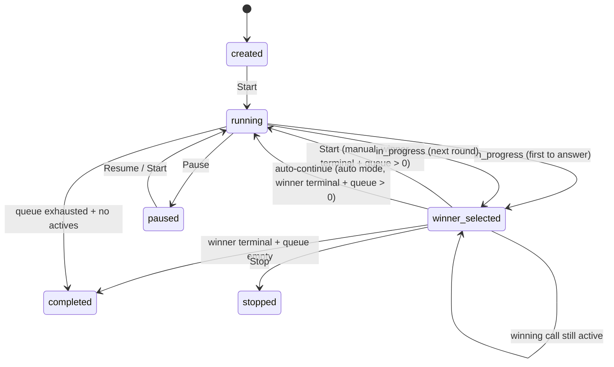

# Implementation plan: Multi-round session continue

**Status:** Planned  
**Created:** 2026-07-20  
**Updated:** 2026-07-20  
**Scope:** Allow agents to run multiple connect rounds in one dialing session until the entire contact queue is exhausted.

---

## Summary

Today, when a contact answers (`in_progress`), the session moves to `winner_selected`, cancels other legs, and **stops launching new calls**. There is no way to resume dialing the remaining queue in the same session.

This plan adds multi-round dialing with a **session-level continue mode** toggle:

1. Finish the live winning call
2. Resume the remaining queue either **automatically** or when the agent presses **Start** (manual mode)
3. Repeat until every contact has been attempted
4. Auto-complete the session when the queue is empty and no calls are active

**Start is never allowed while any call is still active** (including the winning live call).

---

## Goals

| Goal | Detail |
| --- | --- |
| Multi-round dialing | One session can produce multiple connects over time |
| Continue mode toggle | Agent chooses **auto-continue** or **manual continue** (Start) |
| Manual pacing | In manual mode, agent presses **Start** after wrap-up to dial the rest of the queue |
| Auto pacing | In auto mode, when the winning call ends and queue remains, session resumes dialing without a click |
| Guard active calls | Agent cannot press **Start** (and backend rejects continue) while any call is ongoing |
| Queue exhaustion | Session completes when no queued/claimed contacts remain and no active calls |
| Audit history | Previous winners remain marked `is_winner = true` on their call attempts |
| Minimal schema change | Drop one index; add one session preference column; no new session statuses |

## Non-goals (v1)

- New session status (e.g. `between_rounds`)
- UI round counter (“Round 2 of N”)
- Nebula disposition / CRM integration on continue
- Clearing or archiving historical winner rows
- Per-round override of continue mode (mode is session-scoped)

---

## Current behavior (baseline)

### Winner selection

When a call reaches `in_progress`:

- `WinnerSelector` atomically sets `sessions.status = winner_selected` and `winning_call_attempt_id`
- Non-winning active calls are cancelled/disconnected
- Reconciliation **no-ops** because orchestrator only claims contacts when `status = running`

### After winning call ends

When the winning call reaches a terminal status (`completed`, etc.):

- Contact is marked `completed`
- Semaphore permit is released
- Session **stays** `winner_selected`
- Queued contacts are **not** dialed
- UI only offers **Stop** (not Resume or Start)

### Session completion

`maybeCompleteSession` runs during reconciliation while `running`. It marks the session `completed` when:

- No active call attempts, and
- No contacts in `queued` or `claimed`

This path does not run while the session is `winner_selected`.

### Schema constraint

```sql
CREATE UNIQUE INDEX one_winner_per_session
ON call_attempts (session_id)
WHERE is_winner = TRUE;
```

This prevents marking a second winner in the same session even if `winning_call_attempt_id` is cleared.

---

## Target behavior

### Continue mode

Each session has a boolean preference **`autoContinue`** (default: `false` = manual).

| Mode | When winning call goes terminal + queue has contacts | Agent action |
| --- | --- | --- |
| **Manual** (`autoContinue = false`) | Session stays `winner_selected` | Agent presses **Start** to resume dialing |
| **Auto** (`autoContinue = true`) | Backend immediately transitions to `running` and reconciles | No click required |

In both modes, if the winning call goes terminal and the **queue is empty**, the session auto-completes (`completed`).

### Start guard (ongoing call)

**Start** (initial start from `created`, resume-from-winner, and any continue path) must be blocked when the session still has an **active** call attempt.

| Situation | Start / continue allowed? |
| --- | --- |
| Session `created`, no calls | Yes |
| Session `paused`, no active calls | Yes (existing resume/start rules) |
| Session `winner_selected`, winning call still `in_progress` (or any active status) | **No** |
| Session `winner_selected`, winning call terminal, queue > 0 | Yes (manual: Start; auto: already handled) |
| Session `winner_selected`, winning call terminal, queue empty | N/A — session should complete |

UI: disable **Start** while any active call exists.  
API: reject continue/start-from-winner with a clear error if active calls remain.

### State machine



### Agent workflow

1. Create session with contact batch; optionally set **Auto-continue** toggle (default off)
2. Press **Start** → concurrent dials fill to concurrency limit
3. One contact answers → session becomes `winner_selected`; other legs cancelled
4. Agent completes live conversation (simulate `completed` in dev)
5. Resume remaining queue:
   - **Manual:** agent presses **Start** (only enabled once no call is ongoing and queue remains)
   - **Auto:** backend resumes dialing immediately after the winning call ends
6. Session returns to `running`; orchestrator claims and dials next contacts
7. Repeat steps 3–6 until queue is empty
8. When the last winning call ends and queue is empty → session auto-completes

### Toggle UX

- Control: a toggle (or two-state button) labeled **Auto-continue** / **Manual**
- Placement: session setup and/or session bar while session is non-terminal
- Changing the toggle mid-session updates the session preference immediately (PATCH or include on create)
- Toggle does **not** itself start dialing; it only chooses what happens when a winning call ends with queue remaining

### Design decisions

| Decision | Choice | Rationale |
| --- | --- | --- |
| Continue trigger | Toggle: auto vs manual **Start** | Agents who need wrap-up use manual; power users can auto-fire the next batch |
| Manual action label | Reuse **Start** (not a separate Continue button) | Same mental model: Start means “begin/resume dialing the queue” |
| Start while call active | **Forbidden** (UI + API) | Prevents overlapping dial rounds during a live connect |
| Historical winners | Keep `is_winner = true` on old attempts | Audit trail across rounds |
| Current winner pointer | Clear `winning_call_attempt_id` on continue | Enables `trySelectWinner` for next round |
| Terminal winner for continue | Any terminal call status | Consistent with existing cleanup semantics |
| Final round completion | Auto-complete on winner hangup when queue empty | Avoids useless Start click |
| Default mode | Manual (`autoContinue = false`) | Safer default; agent opts into auto |

---

## Implementation phases

### Phase 1 — Schema migration

**New file:** `migrations/003_allow_multiple_session_winners.sql`

```sql
BEGIN;

DROP INDEX IF EXISTS one_winner_per_session;

ALTER TABLE dialing_sessions
  ADD COLUMN auto_continue BOOLEAN NOT NULL DEFAULT FALSE;

COMMIT;
```

**Notes:**

- No new session statuses
- `winning_call_attempt_id` remains the **current** winner pointer only
- `trySelectWinner` already requires `winning_call_attempt_id IS NULL`
- `auto_continue` is the session preference for auto vs manual resume

**Test update:** Integration test “migration replaces schema…” should stop expecting `one_winner_per_session` after migration 003 runs; assert `auto_continue` column exists.

---

### Phase 2 — Domain rules

**File:** `src/domain/statuses.ts`

Add:

```ts
export function canContinueSession(status: SessionStatus): boolean {
  return status === "winner_selected";
}
```

Extend start rules so **Start** from `winner_selected` is allowed when continue preconditions pass (or keep a dedicated `canContinueSession` used by the same Start service path).

Add dial event types:

```ts
"session_continued"
"session_auto_continued"
"session_auto_continue_updated" // optional, if toggle is PATCHed mid-session
```

**File:** `tests/unit/statuses.test.ts`

- `canContinueSession("winner_selected")` → true
- `canContinueSession("running")` → false
- Other non-continuable statuses → false

---

### Phase 3 — Domain / mappers / create input

**Files:**

- `src/domain/session.ts` — add `autoContinue: boolean`
- `src/repositories/mappers.ts` — map `auto_continue`
- `src/services/session-service.ts` — accept optional `autoContinue` on create (default `false`)
- Serialize `autoContinue` on session responses and status snapshot

**Optional:** `PATCH /sessions/:id` (or `POST /sessions/:id/auto-continue`) to flip the toggle mid-session without restarting.

---

### Phase 4 — Repository

**File:** `src/repositories/session.repository.ts`

#### `continueFromWinner(sessionId: string)`

```sql
UPDATE dialing_sessions
SET
  status = 'running',
  winning_call_attempt_id = NULL,
  paused_at = NULL,
  state_version = state_version + 1,
  updated_at = NOW()
WHERE id = $1
  AND status = 'winner_selected'
  AND winning_call_attempt_id IS NOT NULL
RETURNING *
```

Returns `null` if preconditions fail (race or invalid state).

#### `setAutoContinue(sessionId, autoContinue)`

Persist toggle changes and bump `state_version`.

#### Extend `markCompleted`

Allow transition from `winner_selected` in addition to `running`:

```ts
expectedStatuses: ["running", "winner_selected"]
```

#### Extend `create`

Insert `auto_continue` from create input (default `false`).

---

### Phase 5 — Session completion helper

Extract shared logic from `SessionOrchestrator.maybeCompleteSession` into a reusable module so both the orchestrator and call status processor apply identical rules.

**New file (suggested):** `src/services/session-completion.ts`

```ts
export async function tryCompleteSessionIfExhausted(
  db: DbPool,
  sessionManager: SessionManager,
  sessionId: string,
): Promise<boolean>
```

Logic (unchanged from today):

1. If active call count > 0 → return false
2. If any contacts in `queued` or `claimed` → return false
3. Mark session `completed`, append `session_completed` event, update controller status
4. Return true

**Update:** `src/services/session-orchestrator.ts` — delegate to shared helper  
**Update:** `src/services/call-status-processor.ts` — call helper when winning call goes terminal

---

### Phase 6 — Session service: continue / Start-from-winner

**File:** `src/services/session-service.ts`

#### Shared continue core (used by Start and auto-continue)

`continueDialing(sessionId: string, reason: "manual_start" | "auto"): Promise<DialingSession>`

**Preconditions:**

| Check | Error |
| --- | --- |
| `canContinueSession(session.status)` | Invalid session transition |
| `session.winningCallAttemptId` is set | Invalid session transition |
| Winning call exists | Not found |
| Winning call is terminal | “Finish the current call before continuing” |
| **No active calls on session** | “Cannot start while a call is ongoing” |
| `queuedContactCount > 0` | “No contacts remaining in queue” |

**Actions:**

1. `sessions.continueFromWinner(sessionId)` — atomic transition
2. Append `session_continued` or `session_auto_continued` event with `{ previousWinningCallAttemptId, reason }`
3. `controller.status = "running"`
4. `orchestrator.scheduleReconcile(sessionId)`
5. Return updated session

#### Wire into Start

`start(sessionId)` today allows `created` / `paused`. Extend so:

- If status is `winner_selected` → call `continueDialing(sessionId, "manual_start")`
- Else keep existing start/resume-from-paused behavior

This way the UI can show a single **Start** button for “begin dialing” and “resume queue after winner.”

#### Ongoing-call guard for all Start paths

When starting from `created` / `paused`, also reject if unexpected active calls exist (defensive). When starting from `winner_selected`, the active-call check above is required.

---

### Phase 7 — Call status processor (auto-continue + complete)

**File:** `src/services/call-status-processor.ts`

In `handleTerminal`, when `attempt.isWinner`:

1. Existing: mark contact completed, release permit, append `call_terminal`
2. Call `tryCompleteSessionIfExhausted(sessionId)`
   - If completed → done
3. Else if queue remains:
   - Load session `autoContinue`
   - If `true` → `continueDialing(sessionId, "auto")`
   - If `false` → stay `winner_selected`; agent must press **Start**

Non-winning terminal attempts: unchanged (schedule reconcile if session is `running`).

---

### Phase 8 — API

**File:** `src/routes/sessions.routes.ts`

| Method | Path | Notes |
| --- | --- | --- |
| `POST` | `/sessions` | Accept optional `autoContinue` (default `false`) |
| `POST` | `/sessions/:id/start` | Also resumes from `winner_selected` when continue preconditions pass |
| `PATCH` or `POST` | `/sessions/:id/auto-continue` | Optional: flip `{ autoContinue: boolean }` mid-session |

Dedicated `POST /continue` is **optional**; preferred UX reuses **Start**. If kept as an alias, it must share the same service method and guards.

**File:** `README.md`

Document `autoContinue`, Start-from-winner behavior, and “Start rejected while a call is ongoing.”

---

### Phase 9 — Frontend

**Files:**

| File | Change |
| --- | --- |
| `frontend/src/lib/types.ts` | `autoContinue` on session / create input |
| `frontend/src/lib/api.ts` | Pass `autoContinue`; optional PATCH helper |
| `frontend/src/lib/store.svelte.ts` | Store preference; Start already covers continue |
| `frontend/src/components/SessionSetup.svelte` | Toggle **Auto-continue** vs **Manual** before create |
| `frontend/src/components/SessionBar.svelte` | Toggle mid-session; **Start** visibility/disabled rules |

#### Toggle

- Label examples: **Auto-continue** (on) / **Manual** (off)
- Setup: include in create payload
- Session bar: allow flipping while status is not terminal; disabled while `store.busy` if needed

#### Start button visibility / enablement

Show **Start** when:

- `session.status === "created"`, or
- `session.status === "paused"`, or
- `session.status === "winner_selected"` **and** `queuedContactCount > 0`

**Disable Start** when any of:

- `store.busy`
- There is an active call (`snapshot.activeCallCount > 0`, or winning call still non-terminal)
- Session is `winner_selected` but winning call is still ongoing

Tooltip / helper text when disabled due to ongoing call: “Finish the current call before starting.”

#### Winner card

No change required if it derives from `snapshot.winningCall` while `winner_selected`. After continue clears `winning_call_attempt_id`, the card hides until the next connect.

---

### Phase 10 — Recovery

**File:** `src/services/recovery-service.ts`

Existing behavior should mostly suffice:

- `winner_selected` on startup → recreate controller, cancel non-winners
- If winner is already terminal + queue remains:
  - Manual → agent presses **Start** after reload
  - Auto → recovery may call `continueDialing(..., "auto")` once, or leave for the next status event (prefer explicit auto-resume on recovery if `autoContinue` and safe)

No major recovery rewrite required for v1 beyond respecting `autoContinue`.

---

### Phase 11 — Tests

#### Unit

**File:** `tests/unit/statuses.test.ts`

- `canContinueSession` cases

#### Integration

**File:** `tests/integration/dialer.test.ts`

**Test A — manual Start after winner**

1. Create session: 6 contacts, concurrency 2, `autoContinue: false`
2. Start → wait for 2 active calls
3. Simulate one call to `in_progress` → session `winner_selected`
4. `POST /start` while winner still `in_progress` → **rejected**
5. Simulate winner to `completed`
6. `POST /start` → status `running`
7. Wait for additional call attempts; prior winner still `isWinner: true`
8. Exhaust queue → `completed`

**Test B — auto-continue after winner**

1. Create session with `autoContinue: true`
2. Start → answer → winner → complete winner
3. Without calling Start, assert session returns to `running` and new calls launch
4. Exhaust or stop as needed

**Update test #1:** Migration expectations after 003 (`auto_continue` present; `one_winner_per_session` gone)

**Regression:** Test #14–17 (concurrent answers) — reconcile still must not launch while `winner_selected` (manual mode)

---

## Files touched

| File | Change |
| --- | --- |
| `migrations/003_allow_multiple_session_winners.sql` | **New** — drop `one_winner_per_session`; add `auto_continue` |
| `src/domain/statuses.ts` | `canContinueSession`, continue-related events |
| `src/domain/session.ts` | `autoContinue` |
| `src/repositories/mappers.ts` | Map `auto_continue` |
| `src/repositories/session.repository.ts` | `continueFromWinner`, `setAutoContinue`, extend create/`markCompleted` |
| `src/services/session-completion.ts` | **New** — shared completion helper |
| `src/services/session-orchestrator.ts` | Use shared completion helper |
| `src/services/session-service.ts` | `continueDialing`, Start-from-winner, create/toggle `autoContinue` |
| `src/services/call-status-processor.ts` | Auto-complete + auto-continue branch |
| `src/routes/sessions.routes.ts` | Create field; Start behavior; optional toggle route |
| `frontend/src/lib/types.ts` | Types |
| `frontend/src/lib/api.ts` | Client methods |
| `frontend/src/lib/store.svelte.ts` | Store wiring |
| `frontend/src/components/SessionSetup.svelte` | Continue-mode toggle |
| `frontend/src/components/SessionBar.svelte` | Toggle + Start enablement rules |
| `tests/unit/statuses.test.ts` | Unit tests |
| `tests/integration/dialer.test.ts` | Migration + manual/auto multi-round tests |
| `README.md` | API / UX documentation |

**Estimated size:** ~250–350 LOC, 1 migration, ~5–7 hours focused work.

---

## Edge cases

| Case | Expected behavior |
| --- | --- |
| Start while winning call is `in_progress` | UI disabled; API `400` — cannot start while a call is ongoing |
| Start / continue with empty queue | `400` — no contacts remaining (UI should hide Start for winner path) |
| Concurrent Start requests after winner | One succeeds; other gets invalid transition / conflict |
| Auto-continue race with manual Start | Idempotent continue transition; second attempt fails safely |
| Toggle auto→manual while on live winner call | Preference updates; after hangup, wait for Start |
| Toggle manual→auto while already terminal + queued | Optional: immediately continue once, or wait until next hangup — **prefer wait until next hangup** for predictability |
| Second connect in same session | Allowed after index drop + cleared `winning_call_attempt_id` |
| Winner hangs up, queue empty | Auto `completed`; no Start needed |
| Stop during `winner_selected` | Existing stop flow unchanged |
| Page refresh in `winner_selected` | Session restored with `autoContinue`; Start (manual) or auto path on recovery |
| Multiple historical winners | Multiple rows with `is_winner = true`; snapshot shows current via `winning_call_attempt_id` only |

---

## Build order

1. Migration + update migration integration test
2. Domain / mappers / create `autoContinue`
3. Repository + unit tests
4. Session completion helper
5. `continueDialing` + Start-from-winner + active-call guard
6. Call status processor: complete + auto-continue branch
7. Integration tests (manual Start + auto-continue)
8. Frontend toggle + Start enablement
9. README update

---

## Verification checklist

- [ ] `npm run db:migrate` applies 003 cleanly
- [ ] `npm run typecheck` passes
- [ ] `npm test` passes (unit + integration)
- [ ] `npm run check --prefix frontend` passes
- [ ] Manual mode: winner → complete → Start disabled until call ends → Start → new dials launch
- [ ] Manual mode: Start rejected/disabled while winning call still active
- [ ] Auto mode: winner → complete → new dials launch without Start
- [ ] Either mode: winner → complete → queue empty → session completes
- [ ] Toggle visible on setup and session bar; preference persists on session
- [ ] Second round can produce a new winner
- [ ] Regression: reconcile does not launch while `winner_selected` in manual mode

---

## Open questions (resolved for v1)

| Question | Decision |
| --- | --- |
| Manual vs auto continue? | **Both** — session toggle; default manual |
| Manual action? | Reuse **Start** (not a separate Continue button) |
| Start while a call is ongoing? | **No** — UI disable + API reject |
| Allow multiple `is_winner` rows per session? | **Yes** — drop unique index |
| Which terminal statuses allow continue? | **Any** terminal status on winning call |
| New session status for between rounds? | **No** — reuse `running` / `winner_selected` |
| Default `autoContinue`? | **`false` (manual)** |
