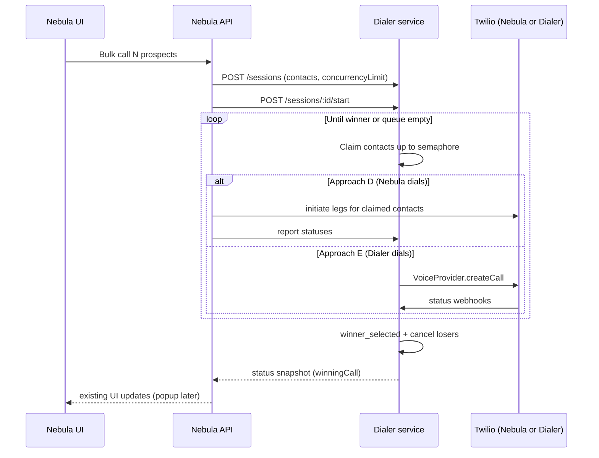

# Integration Plan: Concurrent Dialer → Nebula

## Goal

Seamlessly integrate the concurrent outbound dialer service into Nebula so that:

1. **Nebula** creates dialer sessions and passes a list of prospects for bulk calling.
2. **No Nebula session page** — the dialer Svelte visualizer stays dialer-local for mock testing only.
3. **No call popup** in this phase — agent call UI / floating dialer is handled later.
4. Dialer remains the system of record for **queue ordering, concurrency admission, and winner selection**.

---

## Status update (2026-07-24)

The core integration approach below is unchanged. Since the first draft, the **dialer visualizer** gained a reference call-card UI that de-risks the future Nebula popup work (still out of scope for the Nebula wiring itself):

- **`frontend/src/lib/components/BrowserCallDialer.svelte`** — UI-only floating call card ported from Nebula. In the visualizer it is driven by `WinnerPopup.svelte` and shows **only the winning call** (session `winner_selected` + call still active). Actions are limited to Mute / Keypad / End Call / Cancel / Dismiss (no Listen-in, no Drop VM).
- **Reusable helpers** under `frontend/src/lib/browser-call-dialer/`:
  - `types.ts` — `CallStatus` shape
  - `amdUi.ts` — AMD headline/subline/variant + human-first sort
  - `callDisplay.ts` — status color/icon, duration, card position, status label
  - `liveTranscriptSubscription.ts` — `configureLiveTranscriptClient()` accepts any broadcast client matching a small interface, so **Nebula can inject Supabase Realtime** without changing the component
- **`frontend/src/lib/components/MinimizedTool.svelte`** — draggable, edge-snapping floating session control (Start / Pause / Resume / Stop / Close, glows green on live call, amber while dialing, shows remaining contacts). A UX pattern for a compact "session in progress" control, not required for Nebula.

**Caveats for reuse:** the visualizer's `BrowserCallDialer` is now coupled to `VisualizerStore` (takes a `store` prop and derives the winner internally), so it is a **reference/pattern**, not a drop-in for Nebula. Nebula's own prop-based dialer (`activeCalls` map, dispatched events) remains the integration target when the popup phase begins. The extracted helpers and the pluggable transcript client are the directly reusable pieces.

---

## Current state (mismatch)

| Concern | Concurrent dialer today | Nebula today |
|--------|-------------------------|--------------|
| Queue / concurrency | Server-side session + semaphore + durable `dialing_contacts` | Client-side `concurrentBulkQueue` in `ProspectsPage` |
| Placing calls | `VoiceProvider` (mock only) | Nebula `/api/call/initiate*` + Twilio Device |
| Winner | Atomic DB `winner_selected` + cancel non-winners | “First human” / agent focus heuristics |
| Identity | `clientId`, `agentId`, `externalContactId`, E.164 | Auth user, `contact_key`, prospect lists |
| UI | Svelte visualizer (dialer-local) + reference call card / minimized tool | Prospects / Action Required bulk call |

**Hard product decision:** who actually places the Twilio call? That choice drives the integration approach more than hosting does.

---

## Target experience (without popup)

1. Agent selects prospects (list / filters / Action Required).
2. Nebula creates a dialer session with that batch + concurrency limit.
3. Nebula starts the session.
4. Dialer fills concurrency, progresses statuses, selects a winner, cancels losers.
5. Nebula observes session/call state (poll or push) and reflects progress in **existing** Nebula UI (queue badge, dialing list, etc.).
6. When a winner is selected / connected, Nebula’s **existing** call machinery takes over for the agent experience (popup later).
7. Agent hang-up / continue / stop maps to dialer `stop` / `start` (continue) / `autoContinue`.

---

## Approaches and tradeoffs

### Approach A — Sidecar HTTP service (recommended default)

Run the dialer as its own Fastify service. Nebula server routes call it with service auth.

```text
Nebula UI  →  Nebula SvelteKit API  →  Dialer REST  →  Dialer Postgres
                                      ↕ webhooks/status (if dialer owns Twilio)
```

**Nebula responsibilities**

- Map prospects → `{ externalContactId: contact_key, phoneNumber }`
- `POST /sessions` + `POST /sessions/:id/start`
- Poll `GET /sessions/:id/status` (or WebSockets later)
- Map dialer statuses into existing Prospects UI
- AuthZ: only the agent’s sessions; bind `clientId` to workspace/org, `agentId` to user

| Pros | Cons |
|------|------|
| Clear boundary; dialer stays independently deployable/testable | Extra hop + ops (deploy, health, env) |
| Reuses existing session API as-is | Need auth between Nebula ↔ dialer |
| Visualizer can keep hitting dialer in local/dev | Network failure modes; versioning API contracts |
| Fits “one active session per client” DB constraint | Cross-service tracing/debugging harder |

**Best when:** the dialer should remain the system of record for concurrency and winner selection.

---

### Approach B — Dialer as an in-process library / worker inside Nebula

Publish dialer domain (orchestrator, repositories, winner selector) as a package (or monorepo import). Nebula hosts it in the same Node process or a Nebula worker.

| Pros | Cons |
|------|------|
| No inter-service network | Couples release cycles; harder to keep dialer’s mock visualizer clean |
| Shared auth/DB possible | Risk of pulling dialer Postgres schema into Nebula’s Supabase world awkwardly |
| Lower latency | Process crash / scale characteristics become Nebula’s problem |
| | Single-process semaphore limitation remains unless redesigned |

**Best when:** you want zero new deployables and accept tighter coupling.

---

### Approach C — Shared database, Nebula writes sessions, dialer worker claims work

Nebula inserts into `dialing_sessions` / `dialing_contacts` (or a thin “intent” table). A dialer worker polls/claims and runs orchestration.

| Pros | Cons |
|------|------|
| Nebula “owns” create UX with simple SQL/RPC | Schema coupling; migrations must coordinate |
| Worker can scale separately | Easy to bypass invariants (winner race, permit rules) |
| | Two writers = subtle bugs unless dialer is sole mutator of session state |

**Best when:** you already share Postgres and want queue-style handoff. **Not recommended** unless dialer remains the only writer of session/attempt state after create.

---

### Approach D — Dialer as admission controller only (Nebula keeps placing calls)

Dialer does **not** call Twilio. It only:

- Holds the ordered queue
- Issues “claim next contact / acquire permit”
- Accepts status updates from Nebula
- Runs winner selection + cancel signals

Nebula’s existing `/api/call/initiate*` remains the telephony path; client-side `concurrentBulkQueue` is deleted and replaced by dialer claims.

| Pros | Cons |
|------|------|
| Reuses Nebula Twilio/AMD/transcript/conference stack | Must add dialer APIs: claim, report-status, release-permit |
| Fastest path to “real” calls without `TwilioVoiceProvider` | Split brain risk if Nebula forgets to report status |
| Popup later plugs into Nebula call state as today | Cancel-non-winners must call Nebula cancel APIs |
| | More chatty Nebula↔dialer protocol |

**Best when:** browser/conference calling must stay in Nebula near-term, and dialer’s value is **queue + concurrency + winner**, not PSTN origination.

---

### Approach E — Dialer owns Twilio (`TwilioVoiceProvider`)

Implement the roadmap Twilio provider in dialer. Status webhooks → `CallStatusProcessor`. Nebula only creates/starts sessions and reacts to winners (e.g. bridge agent into conference).

| Pros | Cons |
|------|------|
| Cleanest separation; dialer matches its architecture docs | Large port: AMD, conferences, recordings, transcripts, voicemail |
| Winner cancel is local to dialer | Duplicate Twilio config/secrets |
| Nebula UI becomes thinner | Browser-agent join model must be redesigned |
| | Longer time-to-production |

**Best when:** mid/long-term you want dialer to be the outbound engine and Nebula the CRM/agent shell.

---

## Decision matrix

| Priority | Choose |
|----------|--------|
| Ship real bulk dialing soon, keep Nebula Twilio stack | **A + D** (sidecar + Nebula places calls) |
| Long-term clean outbound engine | Evolve to **A + E** |
| Avoid another service at all costs | **B**, still start with D-style call placement |
| Shared DB already, strong ops discipline | **C** only if dialer is sole state mutator |

---

## Recommended phased path

### Phase 0 — Contract

Freeze a Nebula-facing API surface:

- `POST /sessions` — body already close: `clientId`, `agentId`, `concurrencyLimit`, `autoContinue`, `contacts[]`
- `POST /sessions/:id/start|pause|resume|stop`
- `PATCH /sessions/:id/auto-continue`
- `GET /sessions/:id/status` (+ optional `afterVersion`)
- Auth: mTLS or signed service JWT; Nebula never exposes dialer URL to the browser

Map IDs explicitly:

| Dialer field | Nebula meaning |
|--------------|----------------|
| `clientId` | workspace / org id (must satisfy “one active session per client”) |
| `agentId` | Nebula user id |
| `externalContactId` | `contact_key` |
| `phoneNumber` | normalized E.164 |

### Phase 1 — Nebula BFF + replace client queue (Approach A + D hybrid)

Do **not** ship a session page. Add Nebula server routes, e.g.:

- `POST /api/dialer/sessions` — builds contact list from selected prospects, creates + starts dialer session
- `GET /api/dialer/sessions/:id/status` — proxy
- `POST /api/dialer/sessions/:id/stop|start|…`

Replace `concurrentBulkQueue` fill loop with:

1. Create session from selected prospects
2. Poll status
3. For each dialer-active attempt without a Nebula leg yet → place call via existing Nebula initiate APIs
4. Push status transitions back into dialer (new small “report status” endpoint if using Approach D)
5. On `winner_selected` → cancel other Nebula legs; keep winner in existing Nebula call state (popup later)

**Why hybrid first:** unblocks real Twilio without rewriting AMD/transcripts, while moving concurrency/winner off the browser.

### Phase 2 — Product wiring in existing Nebula UI

- Bulk Call confirm → dialer session
- Progress from `queuedContactCount` / `activeCallCount` / attempt statuses
- Stop / pause / auto-continue controls on Prospects (not a new page)
- Action Required bulk call uses same BFF

### Phase 3 — Optional consolidation (Approach E)

If browser-queue sync is painful, implement `TwilioVoiceProvider` + webhooks in dialer and thin Nebula to “start session + join winner.”

---

## Integration sequence (happy path)



---

## Gaps to close before “seamless”

1. **Telephony ownership** — Approach D vs E (above).
2. **Auth** — dialer has no Nebula-user auth today; BFF must enforce tenancy.
3. **One active session per `clientId`** — confirm `clientId` granularity (user vs workspace). Concurrent agents in one workspace may conflict.
4. **Status bridge** — if Nebula dials, dialer must accept Nebula/Twilio-equivalent statuses (`initiated` → `ringing` → `in_progress` / terminal).
5. **Cancel path** — dialer cancel-non-winners must tear down Nebula Twilio legs.
6. **Idempotency** — duplicate bulk-click should not create two sessions; return existing active session for that client/agent.
7. **Observability** — correlate `sessionId`, `callAttemptId`, Nebula `callSid` / `call_log` id.
8. **No visualizer dependency** — keep mock/auto-simulate dialer-only; Nebula never imports the visualizer.

---

## Explicitly out of scope

- Nebula session / visualizer page
- Floating call popup / `BrowserCallDialer` wiring **into Nebula** (a reference card now exists in the visualizer, but it is not wired to Nebula and is store-coupled — see Status update)
- Porting Drop VM / Listen-in into dialer UI

---

## Minimal first milestone (definition of done)

- From Prospects bulk call, Nebula creates + starts a dialer session with the selected prospect list
- Dialer enforces concurrency; Nebula UI shows queue/active counts from dialer status
- On first `in_progress` winner, non-winners are cancelled
- No new Nebula session page; no new call popup
- Visualizer unused in Nebula production path

---

## Reference: dialer session API (today)

| Method | Path | Purpose |
|--------|------|---------|
| `POST` | `/sessions` | Create session + contact batch |
| `GET` | `/sessions/:id` | Session record |
| `GET` | `/sessions/:id/status` | Snapshot (winner, actives, counts); supports `afterVersion` |
| `GET` | `/sessions/:id/runtime` | In-process controller / semaphore snapshot |
| `GET` | `/sessions/:id/contacts` | Contact batch |
| `GET` | `/sessions/:id/calls` | Call attempts |
| `GET` | `/sessions/:id/events` | Append-only events |
| `POST` | `/sessions/:id/start` | Start or continue dialing |
| `PATCH` | `/sessions/:id/auto-continue` | Toggle auto-continue |
| `POST` | `/sessions/:id/pause` | Pause |
| `POST` | `/sessions/:id/resume` | Resume |
| `POST` | `/sessions/:id/stop` | Stop |

Create body shape (zod):

```ts
{
  clientId: string;
  agentId: string;
  concurrencyLimit: number; // 1–15
  autoContinue?: boolean;   // default true
  contacts: Array<{
    externalContactId: string;
    phoneNumber: string;
  }>;
}
```

---

## Follow-ups

- Concrete API diff for Phase 1 (A+D): new dialer report-status / claim endpoints + Nebula BFF routes + which `ProspectsPage` bulk-queue functions to remove
- Auth/tenancy design for `clientId` when multiple agents share a workspace
- Call popup integration plan (separate doc, later) — decide whether Nebula keeps its existing prop-based `BrowserCallDialer` or adopts the visualizer's helper modules (`amdUi`, `callDisplay`, `liveTranscriptSubscription`); the pluggable `configureLiveTranscriptClient()` is the intended seam for Supabase Realtime
