# Migration Plan: concurrent-outbound-dialer → Nebula

**Status:** Proposed  
**Created:** 2026-08-05  
**Updated:** 2026-08-07  

Port the dialer’s durable concurrency engine + in-call UI into Nebula **behind a feature flag**. Nebula’s existing concurrent bulk path stays the default until the flag is on.

Related: [client-side orchestrator](./client-side-orchestrator.md), [multi-round continue](./multi-round-session-continue.md), [ARCHITECTURE.md](../ARCHITECTURE.md).

---

## 1. Goal

**Dual-path, not a hard cutover.** Ship dialer code into Nebula; gate it with `USE_DIALER_ORCHESTRATOR` (name TBD). Flag off = today’s behavior.

| Flag OFF (default) | Flag ON |
|---|---|
| `fillConcurrentBulkSlots` + in-memory queues | `ClientSessionOrchestrator` + `dialing_*` |
| Nebula `BrowserCallDialer` | Dialer `BrowserCallDialer` + `browser-call-dialer/` |
| AMD freeze only | Atomic winner + cancel losers |
| No `/api/dialer` usage from UI | Session create / claim / reconcile |

Shared either way: `initiateBrowserCall`, `/api/call/*`, `twilioAdapter`, `activeCallsStore`, `gtm_outreach`, `call_logs`.

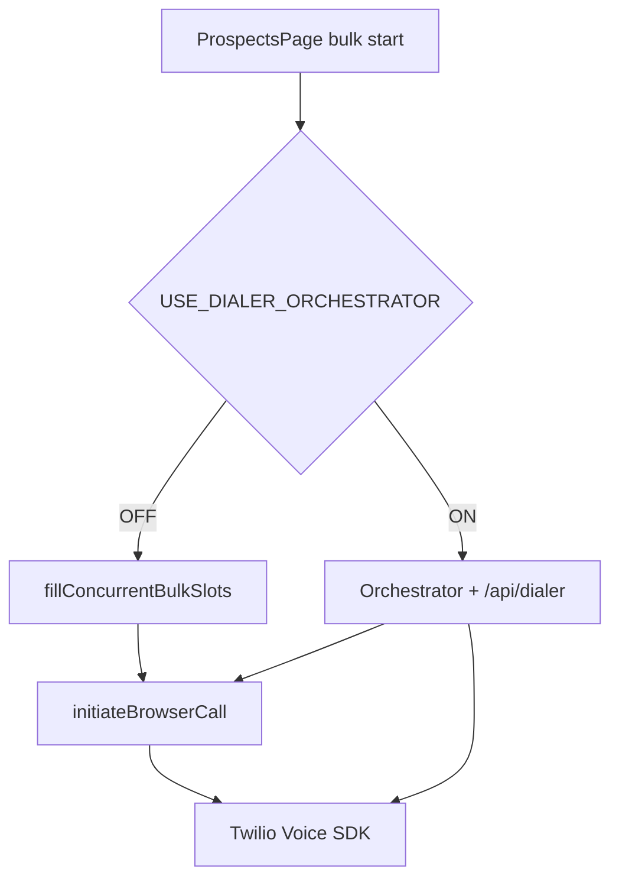
```mermaid
flowchart TB
  PP[ProspectsPage bulk start]
  Flag{USE_DIALER_ORCHESTRATOR}
  Legacy[fillConcurrentBulkSlots]
  New[Orchestrator + /api/dialer]
  Init[initiateBrowserCall]
  SDK[Twilio Voice SDK]

  PP --> Flag
  Flag -->|OFF| Legacy --> Init --> SDK
  Flag -->|ON| New --> Init
  New --> SDK
```

---

## 2. Architecture

### Before — Nebula today

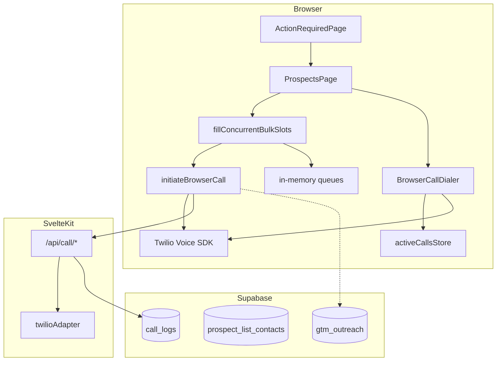
```mermaid
flowchart TB
  subgraph browser [Browser]
    PP[ProspectsPage]
    AR[ActionRequiredPage]
    Init[initiateBrowserCall]
    Fill[fillConcurrentBulkSlots]
    MemQ[in-memory queues]
    NebulaUI[BrowserCallDialer]
    ACS[activeCallsStore]
    SDK[Twilio Voice SDK]
  end

  subgraph kit [SvelteKit]
    CallAPI["/api/call/*"]
    Adapter[twilioAdapter]
  end

  subgraph db [Supabase]
    GO[(gtm_outreach)]
    PLC[(prospect_list_contacts)]
    CL[(call_logs)]
  end

  AR --> PP --> Fill --> Init --> SDK
  Fill --> MemQ
  PP --> NebulaUI --> ACS
  NebulaUI --> SDK
  Init --> CallAPI --> Adapter
  CallAPI --> CL
  Init -.-> GO
```

### After — both paths available

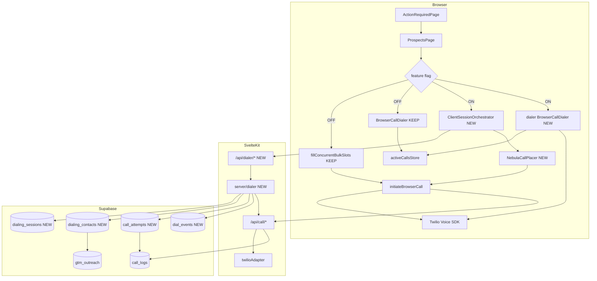
```mermaid
flowchart TB
  subgraph browser [Browser]
    PP[ProspectsPage]
    AR[ActionRequiredPage]
    Flag{feature flag}
    Fill[fillConcurrentBulkSlots KEEP]
    Orch[ClientSessionOrchestrator NEW]
    Placer[NebulaCallPlacer NEW]
    Init[initiateBrowserCall]
    NebulaUI[BrowserCallDialer KEEP]
    DialerUI["dialer BrowserCallDialer NEW"]
    ACS[activeCallsStore]
    SDK[Twilio Voice SDK]
  end

  subgraph kit [SvelteKit]
    CallAPI["/api/call/*"]
    Adapter[twilioAdapter]
    DialerAPI["/api/dialer/* NEW"]
    Engine[server/dialer NEW]
  end

  subgraph db [Supabase]
    GO[(gtm_outreach)]
    CL[(call_logs)]
    DS[(dialing_sessions NEW)]
    DC[(dialing_contacts NEW)]
    CA[(call_attempts NEW)]
    DE[(dial_events NEW)]
  end

  AR --> PP --> Flag
  Flag -->|OFF| Fill --> Init
  Flag -->|OFF| NebulaUI
  Flag -->|ON| Orch --> DialerAPI --> Engine
  Engine --> DS
  Engine --> DC
  Engine --> CA
  Engine --> DE
  Orch --> Placer --> Init
  Flag -->|ON| DialerUI
  Init --> SDK
  Init --> CallAPI --> Adapter
  CallAPI --> CL
  CA --> CL
  DC --> GO
  NebulaUI --> ACS
  DialerUI --> ACS
  DialerUI --> SDK
  Engine --> CallAPI
```

---

## 3. Feature flag

| Concern | Approach |
|---|---|
| Name | `USE_DIALER_ORCHESTRATOR` (env and/or per-user / per-team override) |
| Default | **OFF** |
| Scope | Concurrent bulk on Prospects (+ Action Required deep-link when ON) |
| Sequential bulk | Stays on legacy path until explicitly opted in (`concurrency_limit = 1` or leave as-is) |
| `/api/dialer/*` | Deployed even when flag OFF (tests / `/dev/dialer-session`); UI must not call it when OFF |
| Rollback | Flip flag OFF — no data migration required to restore legacy UX |
| Cleanup | Only after flag ON is stable in prod; then delete legacy queue code / old UI |

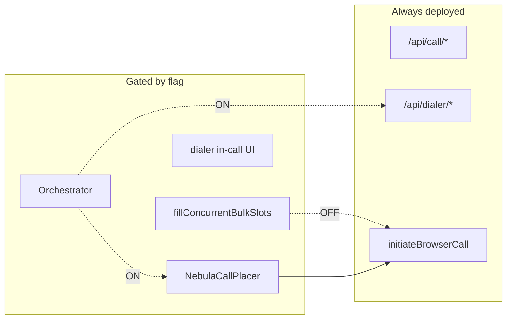
```mermaid
flowchart LR
  subgraph always [Always deployed]
    CallAPI["/api/call/*"]
    DialerAPI["/api/dialer/*"]
    Init[initiateBrowserCall]
  end
  subgraph gated [Gated by flag]
    Orch[Orchestrator]
    Placer[NebulaCallPlacer]
    DialerUI[dialer in-call UI]
    Legacy[fillConcurrentBulkSlots]
  end
  Orch -.->|ON| DialerAPI
  Legacy -.->|OFF| Init
  Orch -.->|ON| Placer --> Init
```

---

## 4. Schema

### Existing Nebula (keep)

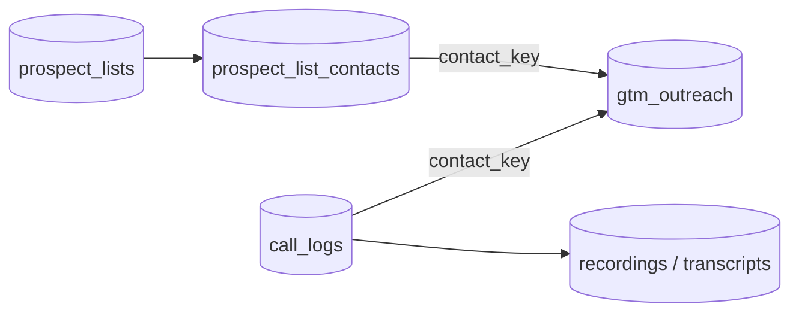
```mermaid
flowchart LR
  PL[(prospect_lists)] --> PLC[(prospect_list_contacts)]
  PLC -->|contact_key| GO[(gtm_outreach)]
  CL[(call_logs)] --> Rec[(recordings / transcripts)]
  CL -->|contact_key| GO
```

### New dialer tables (add; used when flag ON)

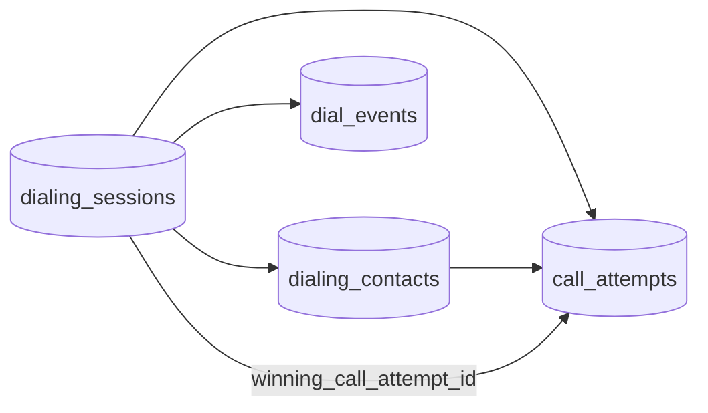
```mermaid
flowchart LR
  DS[(dialing_sessions)] --> DC[(dialing_contacts)]
  DS --> CA[(call_attempts)]
  DS --> DE[(dial_events)]
  DC --> CA
  DS -->|winning_call_attempt_id| CA
```

### Links

| Dialer | Nebula |
|---|---|
| `external_contact_id` | `gtm_outreach.new_key` |
| `provider_call_id` | `call_logs.call_sid` |
| `call_attempts.call_log_id` | `call_logs.id` |
| `dialing_sessions.prospect_list_id` | `prospect_lists.id` |
| `dialing_sessions.user_id` / `agent_id` | `auth.users` / `nebula_user` |
| `concurrency_limit` | seeds from `userMaxConcurrentCalls` |

---

## 5. Seams

Each seam: **before → after (flag ON)**. Flag OFF keeps the before path.

### 1 — Call placement

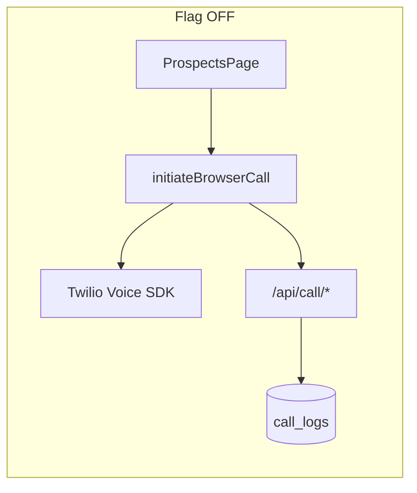
```mermaid
flowchart LR
  subgraph before [Flag OFF]
    PP1[ProspectsPage] --> Init1[initiateBrowserCall] --> SDK1[Twilio Voice SDK]
    Init1 --> CallAPI1["/api/call/*"] --> CL1[(call_logs)]
  end
```

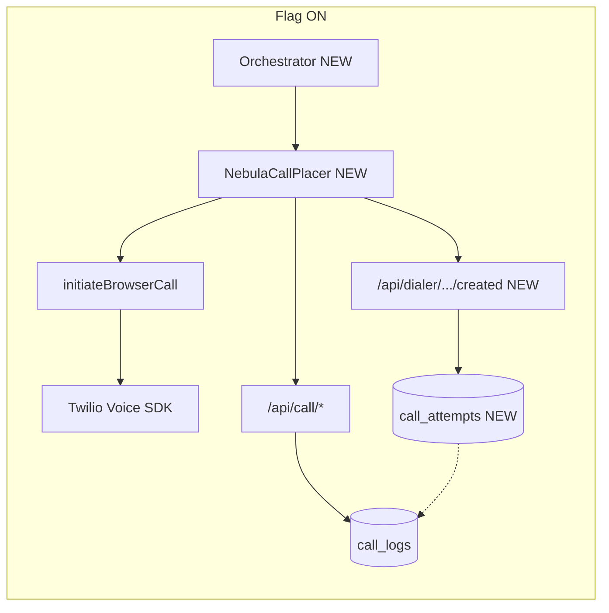
```mermaid
flowchart LR
  subgraph after [Flag ON]
    Orch2[Orchestrator NEW] --> Placer2[NebulaCallPlacer NEW] --> Init2[initiateBrowserCall] --> SDK2[Twilio Voice SDK]
    Placer2 --> CallAPI2["/api/call/*"] --> CL2[(call_logs)]
    Placer2 --> Created2["/api/dialer/.../created NEW"] --> CA2[(call_attempts NEW)]
    CA2 -.-> CL2
  end
```

### 2 — Status → winner

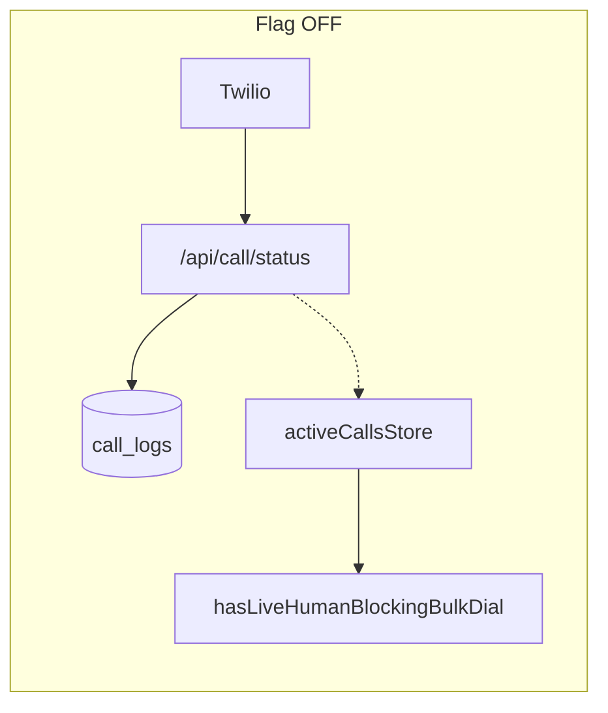
```mermaid
flowchart LR
  subgraph before [Flag OFF]
    TW1[Twilio] --> St1["/api/call/status"] --> CL1[(call_logs)]
    St1 -.-> ACS1[activeCallsStore] --> Freeze1[hasLiveHumanBlockingBulkDial]
  end
```

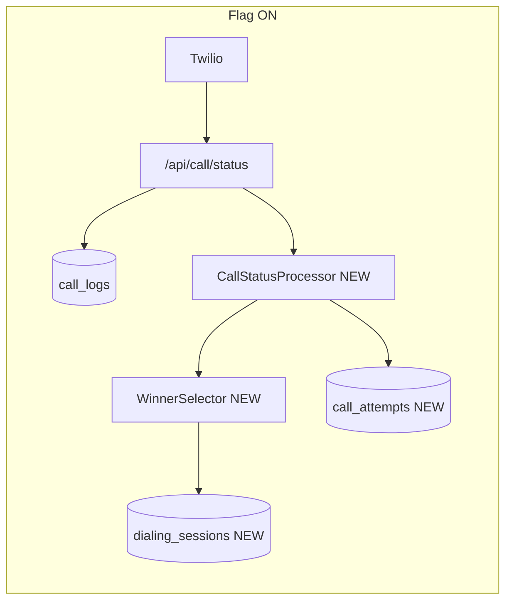
```mermaid
flowchart LR
  subgraph after [Flag ON]
    TW2[Twilio] --> St2["/api/call/status"] --> CL2[(call_logs)]
    St2 --> Proc2[CallStatusProcessor NEW] --> Win2[WinnerSelector NEW] --> DS2[(dialing_sessions NEW)]
    Proc2 --> CA2[(call_attempts NEW)]
  end
```

### 3 — Session create

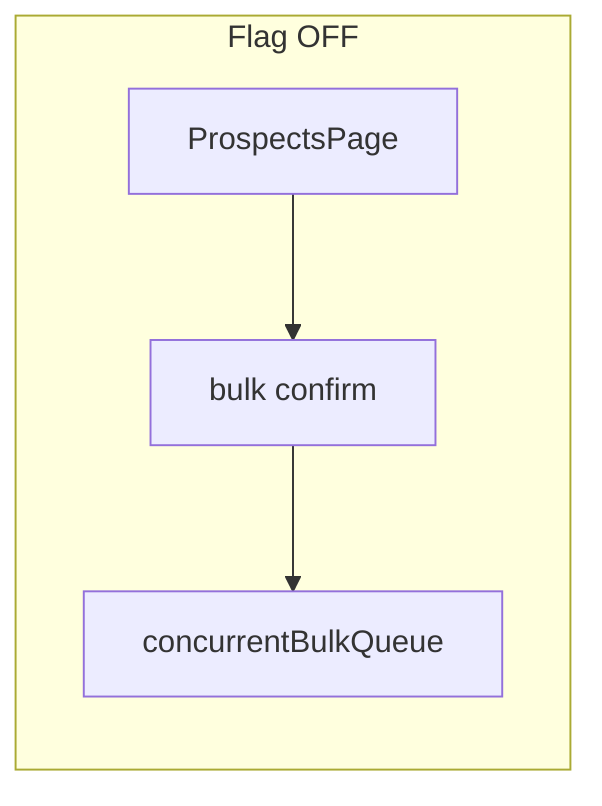
```mermaid
flowchart LR
  subgraph before [Flag OFF]
    PP1[ProspectsPage] --> Confirm1[bulk confirm] --> MemQ1[concurrentBulkQueue]
  end
```

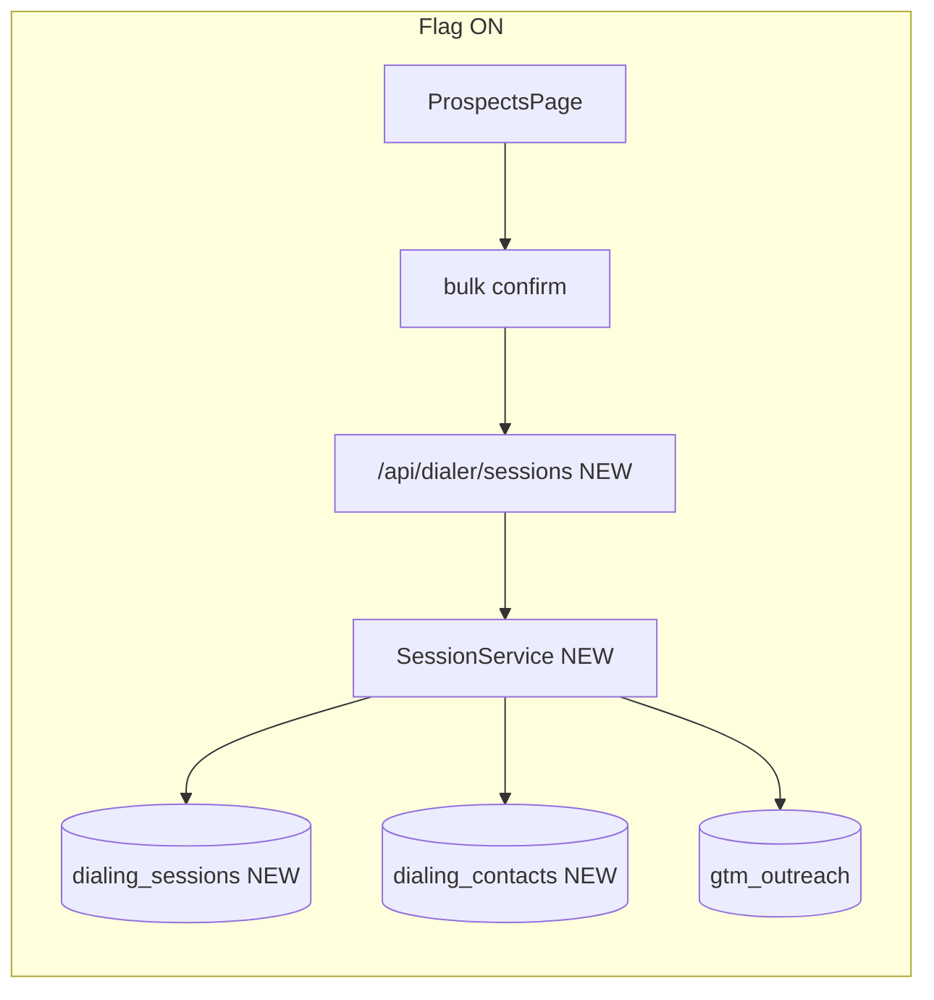
```mermaid
flowchart LR
  subgraph after [Flag ON]
    PP2[ProspectsPage] --> Confirm2[bulk confirm] --> API2["/api/dialer/sessions NEW"] --> Svc2[SessionService NEW]
    Svc2 --> DS2[(dialing_sessions NEW)]
    Svc2 --> DC2[(dialing_contacts NEW)]
    Svc2 --> GO2[(gtm_outreach)]
  end
```

### 4 — Concurrency refill

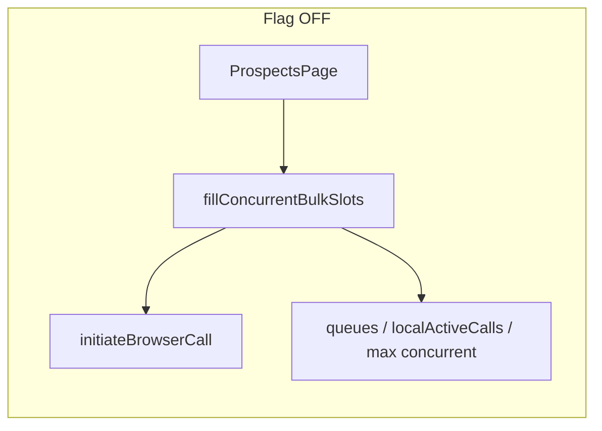
```mermaid
flowchart LR
  subgraph before [Flag OFF]
    PP1[ProspectsPage] --> Fill1[fillConcurrentBulkSlots] --> Init1[initiateBrowserCall]
    Fill1 --> MemQ1[queues / localActiveCalls / max concurrent]
  end
```

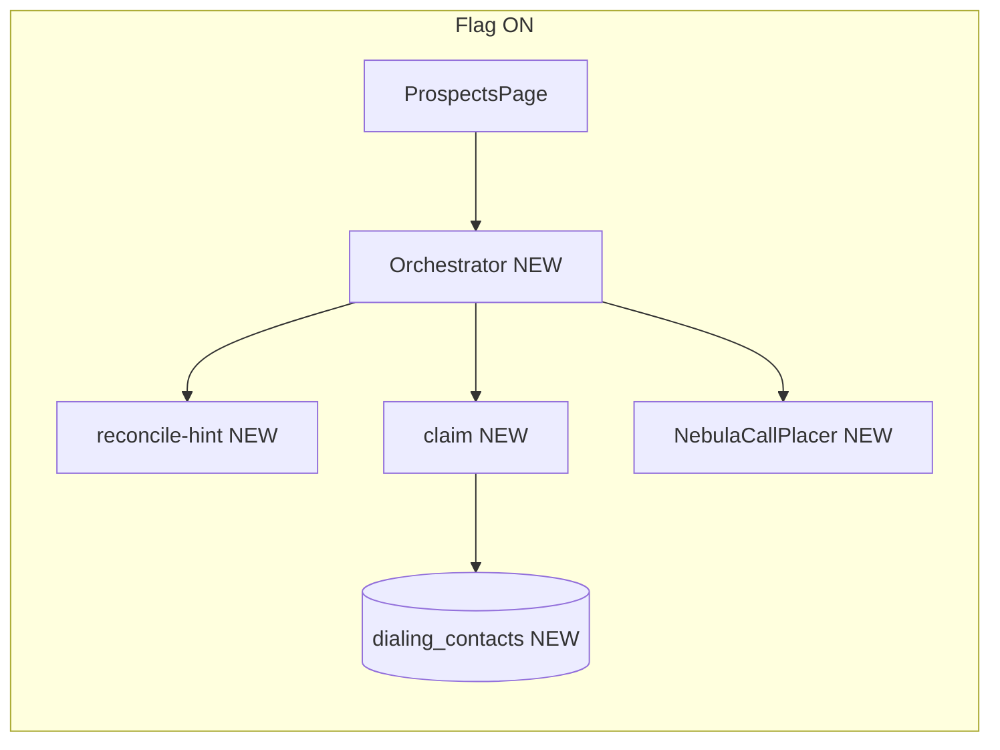
```mermaid
flowchart LR
  subgraph after [Flag ON]
    PP2[ProspectsPage] --> Orch2[Orchestrator NEW]
    Orch2 --> Hint2[reconcile-hint NEW]
    Orch2 --> Claim2[claim NEW] --> DC2[(dialing_contacts NEW)]
    Orch2 --> Placer2[NebulaCallPlacer NEW]
  end
```

### 5 — Cancel losers

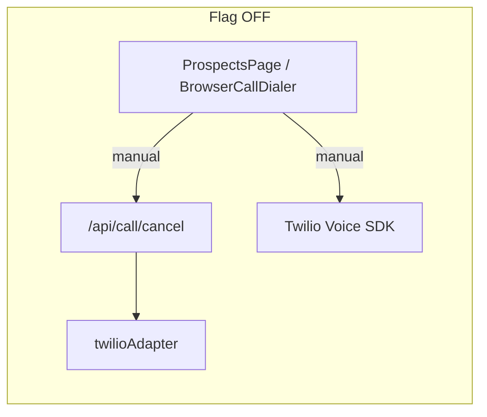
```mermaid
flowchart LR
  subgraph before [Flag OFF]
    UI1[ProspectsPage / BrowserCallDialer] -->|manual| Cancel1["/api/call/cancel"] --> Adapter1[twilioAdapter]
    UI1 -->|manual| SDK1[Twilio Voice SDK]
  end
```

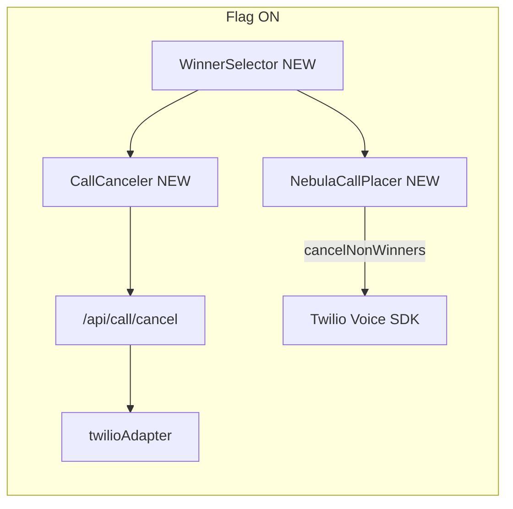
```mermaid
flowchart LR
  subgraph after [Flag ON]
    Win2[WinnerSelector NEW] --> Cancel2[CallCanceler NEW] --> API2["/api/call/cancel"] --> Adapter2[twilioAdapter]
    Win2 --> Placer2[NebulaCallPlacer NEW] -->|cancelNonWinners| SDK2[Twilio Voice SDK]
  end
```

### 6 — Auth / access

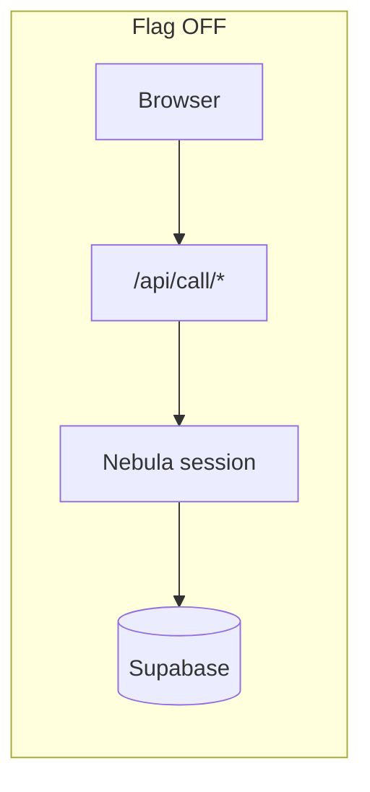
```mermaid
flowchart LR
  subgraph before [Flag OFF]
    Br1[Browser] --> Call1["/api/call/*"] --> Auth1[Nebula session] --> SB1[(Supabase)]
  end
```

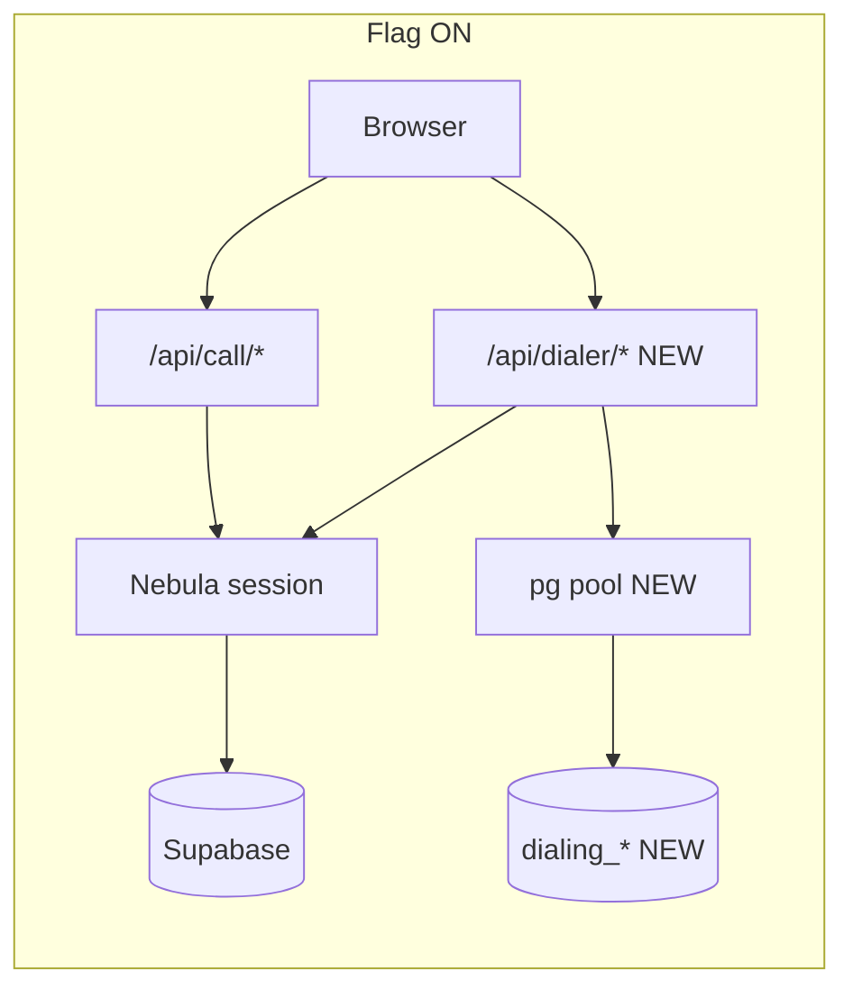
```mermaid
flowchart LR
  subgraph after [Flag ON]
    Br2[Browser] --> Call2["/api/call/*"] --> Auth2[Nebula session] --> SB2[(Supabase)]
    Br2 --> Dial2["/api/dialer/* NEW"] --> Auth2
    Dial2 --> Pg2[pg pool NEW] --> DDB2[(dialing_* NEW)]
  end
```

### 7 — Action Required

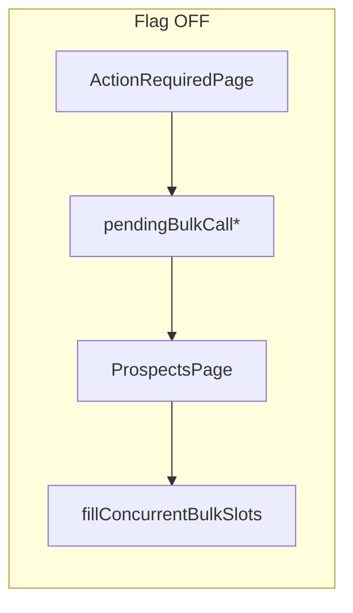
```mermaid
flowchart LR
  subgraph before [Flag OFF]
    AR1[ActionRequiredPage] --> Store1[pendingBulkCall*] --> PP1[ProspectsPage] --> Fill1[fillConcurrentBulkSlots]
  end
```

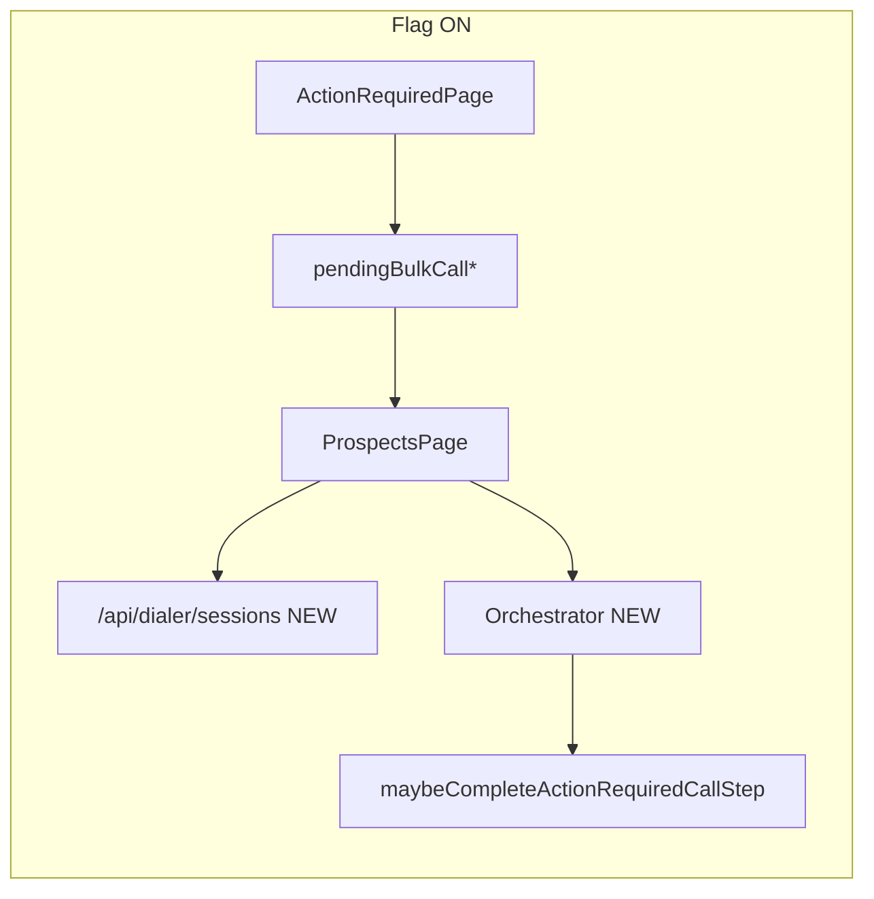
```mermaid
flowchart LR
  subgraph after [Flag ON]
    AR2[ActionRequiredPage] --> Store2[pendingBulkCall*] --> PP2[ProspectsPage]
    PP2 --> API2["/api/dialer/sessions NEW"]
    PP2 --> Orch2[Orchestrator NEW] --> Done2[maybeCompleteActionRequiredCallStep]
  end
```

### 8 — Observability

```mermaid
flowchart LR
  subgraph before [Flag OFF]
    St1["/api/call/status"] --> CL1[(call_logs)] --> TP1[(touchpoints)]
    CL1 --> Rec1[(recordings / transcripts)]
  end
```

```mermaid
flowchart LR
  subgraph after [Flag ON]
    St2["/api/call/status"] --> CL2[(call_logs)] --> TP2[(touchpoints)]
    St2 --> Proc2[CallStatusProcessor NEW] --> DE2[(dial_events NEW)]
    CL2 --> Rec2[(recordings / transcripts)]
  end
```

### 9 — In-call UI

```mermaid
flowchart LR
  subgraph before [Flag OFF]
    PP1[ProspectsPage] --> NebulaUI1[Nebula BrowserCallDialer]
    Layout1[Layout] --> NebulaUI1
    NebulaUI1 --> ACS1[activeCallsStore]
    NebulaUI1 --> SDK1[Twilio Voice SDK]
  end
```

```mermaid
flowchart LR
  subgraph after [Flag ON]
    PP2[ProspectsPage] --> DialerUI2["dialer BrowserCallDialer NEW"]
    Layout2[Layout] --> DialerUI2
    DialerUI2 --> Lib2["browser-call-dialer/ NEW"]
    DialerUI2 --> ACS2[activeCallsStore]
    DialerUI2 --> SDK2[Twilio Voice SDK]
    DialerUI2 --> Orch2[Orchestrator NEW]
  end
```

---

## 6. Port map

| From dialer | Into Nebula |
|---|---|
| server dialer services / repos | `src/lib/server/dialer/` |
| session / claim / status APIs | `src/routes/api/dialer/` |
| `frontend/.../orchestrator/` | `src/lib/dialer/orchestrator/` |
| `frontend/.../browser-call-dialer/` | `src/lib/dialer/browser-call-dialer/` |
| `BrowserCallDialer.svelte` | mount **alongside** Nebula dialer UI (flag chooses which) |
| `migrations/001_dialer_schema.sql` | `supabase/migrations/…_dialing_sessions.sql` |

Do **not** delete legacy bulk/UI until flag ON is proven in production.

---

## 7. `/api/dialer` surface

```
POST   /api/dialer/sessions
GET    /api/dialer/sessions/:id
GET    /api/dialer/sessions/:id/reconcile-hint
POST   /api/dialer/sessions/:id/start|pause|resume|stop
PATCH  /api/dialer/sessions/:id/auto-continue
POST   /api/dialer/sessions/:id/claim
POST   /api/dialer/calls/:id/created|creation-failed|report-status
GET    /api/dialer/sessions/:id/contacts|calls|events
```

`/api/call/*` stays for both flag states. Status webhook feeds dialer processor only when the call is linked to a `call_attempt`.

---

## 8. Phases

**0 — Foundation**  
Migration + `server/dialer` + `/api/dialer` + claim/winner tests. Flag OFF everywhere.

**1 — Flagged orchestrator**  
Orchestrator + `NebulaCallPlacer` + dialer UI on `/dev/dialer-session`. Internal users can set flag ON.

**2 — Prospects behind flag**  
Bulk confirm branches on flag: OFF → legacy; ON → session + orchestrator + dialer UI. Hydrate / `cancelNonWinners` when ON.

**3 — Nebula behaviors (flag ON)**  
AMD → `in_progress` policy. Action Required when ON. `call_logs` ↔ `call_attempts` FKs.

**4 — Optional cleanup (after soak)**  
Only once flag ON is default: remove `fillConcurrentBulkSlots` / old dialer UI / archive dialer repo.

---

## 9. Invariants (flag ON path)

| Mechanism | Job |
|---|---|
| Mutex | Who may claim next |
| Semaphore | How many legs in flight |
| Postgres claim | Which contacts reserved |
| Postgres winner | Which answer won |
| CallCanceler / `cancelNonWinners` | Drop losers |

Client owns *when*. Postgres owns *who*.

---

## 10. Done when

- [ ] Flag OFF: Prospects concurrent bulk unchanged
- [ ] Flag ON: bulk uses `dialing_sessions` + orchestrator
- [ ] Flag ON: one `winning_call_attempt_id` under simultaneous answer; losers canceled
- [ ] Flag ON: tab refresh resumes `running` without over-dial
- [ ] Flag ON: dialer in-call UI; flag OFF: Nebula in-call UI
- [ ] `call_logs` linked when dialer path used
- [ ] Claim / winner / continue tests green
- [ ] Instant rollback by flipping flag OFF
